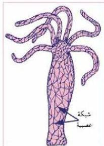

## أ. الجهاز العصبي في اللافقاريات :

يمكن ملاحظة الجهاز العصبي في الجوفمبويات للتعرف على نوعية التنظيم العصبي في اللافقاريات، ففي الهيدرا مثلا يلاحظ وجود نوع من التنظيم العصبي الأولي.

- ما سبب انكماش الهيدرا في حالة لمسها المفاجئ؟

تستجيب الهيدرا للمؤثرات الخارجية فتنكمش لوامسها باللمس المفاجئ (الشكل ٢). وتعود هذه الانفعالية إلى امتلاكها جهاز عصبي بسيط يعرف بالجهاز العصبي الأولي.

- ما مكونات الجهاز العصبي في الهيدرا؟

- كيف يستجيب للمؤثرات الخارجية؟

ادرس الشكل (٢) لاحظ أن الجهاز العصبي للهيدرا عبارة عن خلايا عصبية أولية تتصل زوائدها الشجرية ببعضها مكونة شبكة عصبية، وتتصل هذه الخلايا العصبية بالخلايا الحسية من جهة، وخلايا الاستجابة (اللأسعة) من جهة أخرى مكونة أبسط قوس عصبي، وعن طريقه يتم استقبال التنبيه عن طريق الخلايا الحسية، ومنها ينتقل إلى الخلايا العصبية المتصلة بها، ثم إلى الخلايا العضلية؛ حيث تحدث الاستجابة بانكماش جسم الهيدرا أو لوامسها.

الشكل (٢) الشبكة العصبية في الهيدرا.

### النقاط (١)

• نفذ النشاط الخاص بفحص شرائح مجهرية توضح الشبكة العصبية، والخلية العصبية.

## الجهاز العصبي في الطفيليات (دودة الأرض) :

ما الاستجابة التي تظهرها دودة الأرض في حالة تسليط ضوء شديد عليها؟ ما سبب ذلك؟

### النقاط (٢)

• نفذ النشاط الخاص بتسليط ضوء شديد على دودة الأرض.

تبدي دودة الأرض استجابة واضحة للمؤثرات المحيطة فتتجذب نحو الطعام، وتبتعد عن المواد الضارة، وتتسحب، وتدفن نفسها في التراب في حالة تسليط ضوء شديد عليها، وترجع هذه الانفعالات إلى الرقي، والتعقيد في الحواس، والجهاز العصبي لها.

١٠

الأحياء للصف الثالث الثانوي

http://E-learning-moe.edu.ye