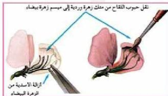

## خطوات دراسة توارث صفات البازلاء:

اتبع مندل خطوات محددة لدراسة توارث كل صفة بشكل مستقل عن بقية الصفات، واستغرق في البداية عامين كاملين، فمثلاً عند دراسته لتوارث صفة لون

الشكل (٤) التلقيح الذاتي للأزهار

الزهرة اتبع الخطوات الآتية:

١- استمر في زراعة البازلاء ذات الأزهار الوردية، والبازلاء ذات الأزهار البيضاء، كل على حدة للحصول على الصفتين بشكل نقي، متبعاً أسلوب التلقيح الذاتي (Self-Pollination) للنباتات خلال عدة أجيال

(الشكل ٤-)، حتى تأكد في الأخير أن النباتات ذات الأزهار الوردية لا تنتج إلا نباتات تحمل أزهاراً بنفس اللون جيلاً بعد جيل، وأن النباتات ذات الأزهار البيضاء لا تنتج إلا أزهاراً بيضاء خلال الأجيال المتعاقبة.

٢- بعد أن تأكد من نقاوة صفتي اللون الوردي واللون الأبيض لأزهار النباتات قام بزرع بذورها في مكان آخر لتنتج نباتات جديدة تحمل أزهاراً وردية وبيضاء.

٣- اتبع أسلوب التلقيح الخلطي (Cross-Pollination) بين النبات ذات الأزهار الوردية، والنبات ذات الأزهار البيضاء، متبعاً الخطوات الآتية:

أ - قام بإزالة الأسدية من الأزهار البيضاء قبل نضجها.

ب - نقل حبوب اللقاح من متك الأزهار الوردية إلى مياسم الأزهار البيضاء بعد نضجها.

الشكل (٥) عملية التلقيح الخلطي بين الأزهار

ج- قام بعكس العملية في نباتات أخرى، أي التخلص من الأسدية في الأزهار الوردية ونقل حبوب اللقاح من متك الأزهار البيضاء إلى مياسم الأزهار الوردية.

الأحياء للصف الثالث الثانوي

http://E-learning-moe.edu.ye

١٠١