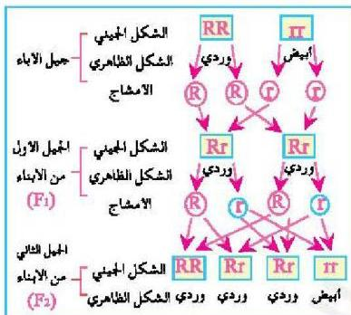

- كيف تعرف كل من الشكل الظاهري والشكل الجيني للصفة؟
- لماذا تكون الصفة المتنحية دائماً نقية؟

الشكل (٦)

# **النقاط (٢)**

ارسم مخططاً لتوارث صفة طول الساق لنبات البازلاء علماً بأن العاملين الوراثيين لصفة الطول النقية هما (TT) والعاملين الوراثيين لصفة القصر هما (tt)، موضحاً في المخطط الاشكال الظاهرية والاشكال الجينية للنبات.

# **استخدام الجداول في حل المسائل الوراثية:**

يمكنك استخدام الجدول الذي يسمى مربع بونيت (Punnet Square)، نسبة إلى العالم الوراثي (Reginald Crundell Punnett) الذي ابتكره واستخدمه في حل المسائل الوراثية وإظهار الاحتمالات الممكنة لظهور الصفات الناتجة عن إخصاب الأمشاج الذكرية للأمشاج المؤنثة في الكائن الحي.
وقد استخدم هذا الجدول في التعبير عن النتائج التي توصل إليها مندل في تجاربه؛ حيث يمكن استخدامه عند معرفة الاشكال الجينية للآباء للتنبؤ باحتمالات ظهورها في الاجيال المتعاقبة للآباء. فمثلاً يمكن التعبير عن احتمالات ظهور اللون الوردي واللون الأبيض للأزهار في نبات البازلاء حسب الخطوات الآتية:

الأحياء للصف الثالث الثانوي

http://E-learning-moe.edu.ye

١٠٥