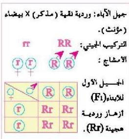
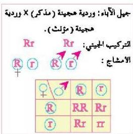

الشكل (٧) مربع بونيت

١- حدد الشكل المظهري لجيل الآباء.
٢- حدد الأمشاج وميز بين الذكورية منها والأنثوية من خلال العلامتين للمذكر و للمؤنث.
٣- ضع الأمشاج الذكورية في الصف الأفقي الأعلى للمربع.
٤- ضع الأمشاج الأنثوية في الصف الرأسي على يسار المربع.
٥- ضع رموز الزيجوت الناتجة عن اندماج كل مشيج ذكري مع مشيج

أنثوي في الخانة المقابلة للمشيجين في المربع (الشكل ٧).

٦- تعرف على نوع كل زيجوت ناتج وحدد نسبة ظهور الصفات المختلفة في الجيل الجديد.
- ما لون الأزهار الناتجة عن حدوث التلقيح الذاتي لنباتات الجيل الأول (F₁) ؟ استخدم مربع بونيت متبعاً نفس الخطوات السابقة للتعرف على ألوان الأزهار الناتجة في جيل الأبناء الثاني، وذلك كما في الشكل (٧).

الشكل (٨) مربع بونيت

- ما الشكل الظاهري لجيل الآباء ؟
- ما التركيب الجيني لجيل الآباء ؟
- ما الأشكال الظاهرية (لون الأزهار) في جيل الأبناء ؟
- حدد التركيب الجيني لكل لون من ألوان أزهار جيل الأبناء.
- ما نسبة الأزهار وردية اللون إلى الأزهار البيضاء في جيل الأبناء ؟

١٠٦

الأحياء للصف الثالث الثانوي

http://E-learning-moe.edu.ye