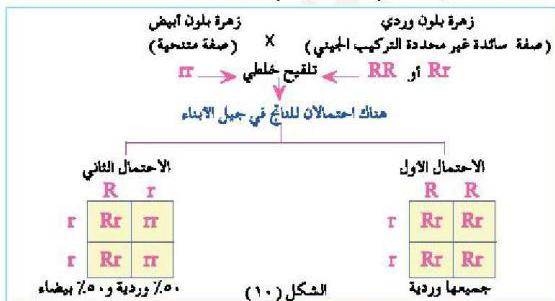

– كيف تحدد فيما إذا كان التركيب الجيني للصفة السائدة نقياً أم هجيناً؟
يمكنك تحديد ذلك عن طريق التلقيح الاختباري.

### التلقيح الاختباري : Test Cross

يعتبر التلقيح الاختباري أفضل الطرق للتفرقة بين الصفات السائدة النقية (Homozygous) والصفات السائدة الهجينة (Heterozygous) في النباتات أو الحيوانات، حيث يتم التلقيح الخلطي بين الفرد المراد معرفة ما إذا كان سائداً نقياً أم سائداً هجيناً مع فرد آخر يحمل الصفة المتنحية المضادة لها كما في الشكل (١٠). فإذا كان كل الناتج يحمل الصفة السائدة (الشكل الظاهري السائد) كان ذلك دليلاً على نقاء الصفة السائدة للفرد، أما إذا كان الناتج خليطاً بين الشكل الظاهري السائد والشكل الظاهري المتنحي (بنسبة ١:١ أو ٥٠٪ وردية و ٥٠٪ بيضاء) كان ذلك دليلاً على عدم نقاوة التركيب الجيني للصفة السائدة للفرد الذي يتم اختباره.
وتلاحظ أنه من خلال معرفة صفات الأبناء الناتجة يمكن تحديد التركيب الجيني للصفة السائدة، وتحديد ما إذا كانت نقية أم هجينة.

### قانون مندل الثاني (التوزيع الحر للصفات) Law of Independent Assortment

استطاع مندل التوصل إلى قانونه الثاني من خلال تجاربه على نبات البازلاء لدراسة السلوك الوراثي لزوجين من الصفات المتضادة في النبات مثل زهرة وردية إبطية وزهرة بيضاء قمية.

– اذكر أمثلة أخرى لزوجين من الصفات المتضادة في نبات البازلاء.

١٠٨

الأحياء للصف الثالث الثانوي

http://E-learning-moe.edu.ye