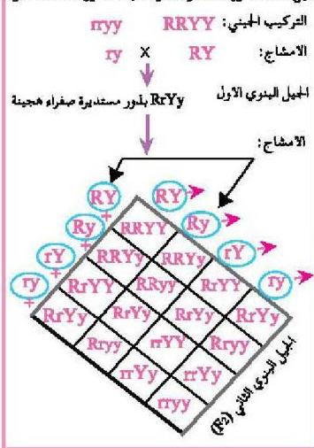

جيل الآباء: بذور مستديرة صفراء نقية X بذور مجمدة خضراء

وقد قام مندل بالخطوات الآتية لدراسة توارث صفتي بذور البازلاء (اللون والشكل):

١- أجرى تلقيحاً خلطياً بين نباتي بازلاء يحمل أحدهما بذوراً ملساء (مستديرة) الشكل وصفراء اللون (الصفتان سائدتان) والتركيب الجيني لهاتين الصفتين هو RRYY، بينما يحمل النبات الآخر بذوراً مجمدة الشكل وخضراء اللون (الصفتان منتحيتان)، والتركيب الجيني لهاتين الصفتين هو ryy كما في (الشكل ١١).

الشكل (١١)

٢- وقد كرر مندل هذه الخطوات عدة مرات.
٣- لاحظ الصفات الظاهرية للبذور في بذور أفراد الجيل البنوي الأول.
- ما الصفات التي ظهرت في أفراد الجيل الأول؟
لقد وجد مندل أن البذور في نباتات الجيل البنوي الأول كانت مستديرة الشكل وصفراء اللون، أي إن الصفات السائدة للبذور تظهر في كل أفراد الجيل البنوي الأول، وتركيبها الجيني هو RrYy.
٤- قام مندل بتلقيح نباتات الجيل الأول مع بعضها البعض تلقيحاً ذاتياً.
٥- لاحظ الصفات الظاهرة للبذور في أفراد الجيل الثاني، حيث كان ناتج أفراد الجيل البنوي الثاني، كما في الشكل (١١) وتحمل بذوراً لها صفات مختلفة موضحة في الجدول (١).

الأحياء للصف الثالث الثانوي

١٠٩

http://E-learning-moe.edu.ye