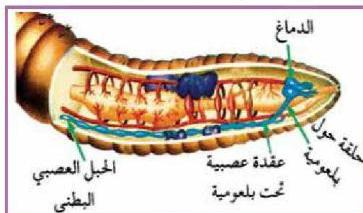

لاحظ الشكل (٣) وتعرّف على مكونات الجهاز العصبي في دودة الأرض.
ستجد أن الجهاز العصبي عبارة عن:

١- عقدة دماغية مزدوجة فوق بلعومية تمتد منها حلقة حول

بلعومية تلتقي تحت
البلعوم بالعقدة
العصبية.

٢- عقدة عصبية تحت
بلعومية.

٣- حبل عصبي بطني
مزدوج عليه عقد
عصبية صغيرة (عقدة

في كل حلقة).

الشكل (٣)

الجهاز العصبي في دودة الأرض.

٤- أعصاب تخرج من العقدة الدماغية، والعقدة العصبية تحت البلعومية تمتد نحو الحلقات الأربع الأولى، في حين تستمد الحلقات التالية أعصابها من عقد الحبل العصبي البطني الذي يستمر امتداده نحو الخلف، ويخرج من كل عقدة في الحبل العصبي زوج من الأعصاب، تتفرع إلى فرعين أحدهما يتوزع على الناحية البطنية والآخر على الجانب، وعبر حواجز الحلقات تتشابك الأعصاب مكونة شبكة من الخيوط العصبية حيث تمكن الدودة من التفاعل مع المؤثرات البيئية المختلفة.

● اكتب عن الجهاز العصبي في المفصليات.

**قضية البحث**

### ب. الجهاز العصبي في الفقاريات:

يصل التنظيم العصبي في الحيوانات الفقارية، وخاصة الثدييات (الإنسان)، إلى مستوى راق من التنسيق بين أجهزة الجسم المختلفة، ويرجع ذلك إلى وجود جهاز عصبي معقد التركيب يتكون من الدماغ، والحبل الشوكي، والأعصاب.

#### ● الجهاز العصبي في الإنسان:

يتعرض الإنسان إلى مؤثرات عديدة؛ حيث تقوم في استقبالها أعضاء حس متخصصة مرتبطة بجهاز عصبي معقد التركيب، يعمل بكفاءة عالية، تضمن للإنسان الاتصال والتكيف الفعال مع البيئة، والقيام بالتنسيق لفعاليات الجسم المختلفة

الأحياء للصف الثالث الثانوي

http://E-learning-moe.edu.ye

١١