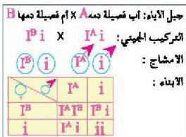

## مسألة محولة :

توصل إلى احتمالات ظهور فصائل الدم المختلفة في جيل الأبناء لأب فصيلة دمه A وتركيبه الجيني I^A و أم فصيلة دمها B والتركيب الجيني لها I^B في (الشكل-١٤).

ستلاحظ أن 1/4 عدد الأبناء يحملون فصيلة الدم A وتركيبها الجيني (I^A i) و 1/4 العدد يحملون فصيلة الدم B وتركيبها الجيني (I^B i) و 1/4 العدد يحملون فصيلة الدم (O) وتركيبها الجيني (ii)، و 1/4 العدد يحملون فصيلة الدم AB وتركيبها الجيني (I^A I^B)، وهي :

الشكل (١٤)

الفصيلة التي تبدو فيها ظاهرة السيادة المشتركة للجينات. وقد وجد أن دراسة توارث فصائل الدم مهمة جداً في الطب الشرعي، إذ تساعد على نفي الأبوة ولكن لا تثبيتها، بل يثبتها الحامض النووي (DNA)، كما ستعرف ذلك في الوحدة اللاحقة.

– هل يمكن أن تكون فصيلة دم الطفل AB إذا كانت فصيلة أحد أبويه O ؟

## النقاط (١٩)

توصل إلى احتمالات ظهور فصائل الدم لأبناء أبوين أحدهما يحمل فصيلة الدم A وتركيبه الجيني (I^A I^A) ويحمل الآخر فصيلة الدم O.

## وراثة العامل الرايزيسي Rhesus Factor.

- – ما المقصود بالعامل الرايزيسي ؟ وما أهميته ؟
- – كيف يتم توارث العامل الرايزيسي ؟

العامل الرايزيسي هو مولد التصاقّي يوجد على غشاء خلايا الدم الحمراء في الإنسان، ويرمز إليه بالرمز (Rh). وفي حالة وجوده يكون الشخص موجب العامل الرايزيسي (Rh^+)، وفي حالة عدم وجوده يكون الشخص سالب العامل الرايزيسي (Rh^-) ويمثل الأشخاص الذين يحملون العامل الرايزيسي حوالي ٨٥% من مجموع أفراد المجتمع، بينما تكون النسبة الباقية لأشخاص سالب العامل الرايزيسي.

١١٨

الأحياء للصف الثالث الثانوي

http://E-learning-moe.edu.ye