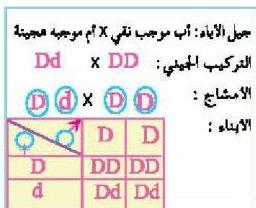

ويتحكم في توارث العامل الرايزيسي زوج من الجينات، فالجين D يكون سائداً ويعمل على تكوين مولد الإلصاق الرايزيسي بينما الجين d يمنع تكون مولد الإلصاق للعامل الرايزيسي، والشخص الموجب للعامل الرايزيسي يكون تركيبه الجيني DD (صفة نقية) أو Dd (صفة هجينة)، بينما يكون التركيب الجيني للشخص سالب العامل الرايزيسي (dd).

# - مسألة محلولة:

تزوج رجل موجب العامل الرايزيسي (صفة نقية) من امرأة موجبة العامل الرايزيسي (صفة هجينة) فما التركيب الجيني لابنائهما؟.

ستلاحظ أن جيل الأبناء كلهم موجبي العامل الرايزيسي بنسبة ٥٠٪ يحملون الصفة النقية و ٥٠٪ يحملون الصفة الهجينة.

الشكل (١٥)

# النقاط (١٠)

توصل إلى احتمالات توارث فصائل الدم والعامل الرايزيسي لدى الأبناء لأب فصيلة دمه (A) موجب العامل الرايزيسي (هجين) وأم فصيلة دمها AB سالبة العامل الرايزيسي، موضحاً نسبة كل فصيلة وعاملها الرايزيسي (AB⁻, B⁻, A⁻, AB⁺, B⁺, A⁺).

وللعلم فإنه يجب مراعاة نوع العامل الرايزيسي للدم عند نقل دم شخص إلى آخر. فمثلاً عند نقل دم من شخص فصيلة دمه A موجب العامل الرايزيسي إلى شخص فصيلة دمه A سالب العامل الرايزيسي، فإن جسم الشخص المستقبل يبدأ بإنتاج أجسام مضادة لمولد الإلصاق (Rh) مما يؤدي إلى تراكم الأجسام المضادة في

الأحياء للصف الثالث الثانوي

http://E-learning-moe.edu.ye

١١٩