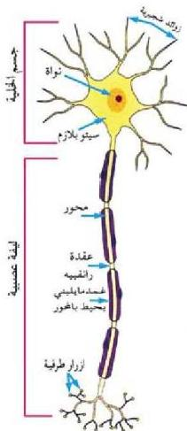

ولتنظيم العلاقة بين أجهزة الجسم وأعضائه المختلفة.

# • النسيج العصبي:

– ما وحدات بناء النسيج العصبي؟ وما وظيفتها؟

يتكون النسيج العصبي من نوعين من الخلايا لاحظ الجدول (١)، وتعرّف على ذلك.

جدول (١) وحدات بناء النسيج العصبي.

|  الخلايا | الوظيفة  |
| --- | --- |
|  الخلايا العصبية. **Neurons** | تكوين ونقل السيل العصبي.  |
|  خلايا الغراء العصبي. **Neuroglia** | دعم وحماية الخلايا العصبية.  |

– مِمَّ تتكون الخلية العصبية؟

رغم اختلاف أشكال، وأحجام الخلايا العصبية إلا أنها تتكون من الأجزاء التالية:
(الشكل ٤):

# ١- جسم الخلية : Cell Body

يحتوي على نواة محاطة بالسيثوبلازم الذي يحوي عضيات، مثل الميثوكوندريا، وأجسام جوجي، والشبكة الإندوبلازمية التي تسمى الشبكة الخشنة، والريبوسومات الحرة وبينها أجسام نسل Nissl Bodies.

# الزوائد الشجرية : Dendrites

عبارة عن بروزات سيثوبلازمية قصيرة متشعبة تستقبل السيلات العصبية، وتوصلها إلى جسم الخلية.

٢- الليفة العصبية : Nerve Fiber مكونة من المحور Axon وهو امتداد طويل لجسم الخلية العصبية، ينقل السيل العصبي بعيداً

الشكل (٤) تركيب الخلية العصبية.

١٢

الأحياء: النصف الثالث الثانوي

http://E-learning-moe.edu.ye