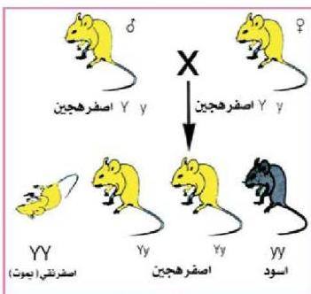

## ثالثاً: الجينات المميتة Lethal genes

مانتيجة تزاوج قار أصفر مع أنثى صفراء اللون كلاهما هجين ؟
وجد أن اللون الأصفر في الفئران يسود على غيره من الألوان مثل اللون الأسود
لهذا تكون نتيجة النسل .

أصفر نقي ، أصفر هجين ، أسود إلا أن الربع الأصفر النقي يموت غالباً
قبل الولادة أو في أطواره الجنينية الأولى وهذا راجع إلى اجتماع عاملين (جيني) اللون
الأصفر معاً مما يؤدي إلى وفاة الفأر الحامل لهما ولهذا يقل عدد الفئران الناجمة بنسبة
٢٥٪ وبهذا المثال لا بد من التنبيه إلى أن جين اللون الأصفر (Y) ذو تأثيرين فهو سائد
من حيث الشكل المظهري ومتنح من حيث قدرته على إحداث الوفاة أما جين اللون

شكل (١٦) الجينات المميتة في الفئران

الأسود (y) فهو متنحي من
حيث الشكل المظهري وسائد
من حيث الحيوية . لذلك
نلاحظ عند اجتماع جين
اللون الأصفر Y مع جين اللون
الأسود y فإنه يسود عليه
سيادة تامة وبذا يظهر الفأر
أصفر هجين Yy

أي أن نتيجة تزاوج قار
أصفر هجين مع أنثى صفراء
هجينة هو شكلين مظهريين
أصفر وأسود بنسبة ٢ : ١

على الترتيب كما في الشكل (١٦)

– بماذا تفسر ظهور بادرات بيضاء اللون خالية من اليخضور (الكلوروفيل) بنسبة
٢٥٪ وبادرات خضراء اللون بنسبة ٧٥٪ عند زراعة بذور ذرة ناجمة من تلقيح
ذاتي لنبات ذرة أخضر اللون مع العلم بأن جين تكوين اليخضور سائد وحيوي
بينما جين انعدام تكوين اليخضور متنحي ومميت .

الأحياء للصف الثالث الثانوي

١٢١

http://E-learning-moe.edu.ye