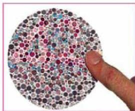

تحوي عدداً زوجياً من الكروموسومات (2n) لأنها تنتج من بيض مخصب، بينما الذكر يحوي عدداً أحادياً من الكروموسومات (n) لأنه ينتج من بيض غير مخصب.

## ثانياً: توارث الصفات المرتبطة بالجنس:

لقد وجد أن كثير من الصفات الوراثية تحمل جيناتها على الكروموسومات الجنسية، لهذا تسمى صفات يرتبط توارثها بالجنس.

- ما الكروموسومات الجنسية؟

- ما هو الكروموسوم الجنسي الذي يحمل معظم الصفات المرتبطة بالجنس؟
ومن أمثلة الصفات التي تنتقل من الآباء إلى الأبناء في الإنسان مرتبطة بالكروموسومات الجنسية، وخاصة الكروموسوم (X)، مرض عمى الألوان الشكل ١٧، ومرض نزف أوسيولة الدم الهيموفيليا (Hemophilia) ومرض البول السكري وغيرها، وهي جميعاً صفات متنحية مسؤول عن إظهارها حين منتج على الكروموسوم (X). وصفة الشعر الكثيف في الأذن المرتبطة بالكروموسوم Y.

الشكل (١٧) بطاقة فحص عمى الألوان

جدول (٣)

|  النوع | مصاب | حامل المرض | سليم  |
| --- | --- | --- | --- |
|  ذكر | X^{b}y | - | X^{B}y  |
|  أنثى | X^{b}X^{b} | X^{B}X^{b} | X^{B}X^{B}  |

فمثلاً يظهر عمى الألوان بين الأبناء وهو عدم القدرة على التمييز بين اللونين الأخضر والأحمر. ويمكن الكشف عن وجود المرض باستخدام البطاقة المبينة في الشكل (١٧). فالشخص الذي يرى الرقم (4) فقط في البطاقة يكون مصاباً بعمى اللون الأخضر وأما الشخص الذي يرى الرقم (2) فقط يكون مصاباً بعمى اللون الأحمر. أما الشخص الذي يستطيع قراءة الرقم (42) فيكون طبيعياً وغير مصاب بالمرض. والجدول (٣) يوضح التركيب الظاهري والتركيب الجيني للمصابين بمرض عمى الألوان وحاملي المرض والأشخاص السليمين من المرض.

- ما التركيب الجيني لأنثى مصابة بعمى الألوان؟
- ما التركيب الجيني لذكر مصاب بعمى الألوان؟

الأحياء للصف الثالث الثانوي

http://E-learning-moe.edu.ye

١٢٣