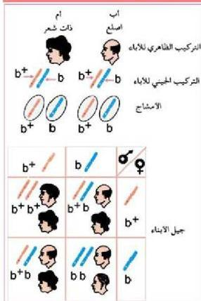

• توصل إلى احتمالات ظهور عمى الألوان لدى الأبناء
لأب مصاب وأم تحمل المرض.

النشاط (١١)

ثالثاً: توارث الصفات المتأثرة بالجنس:

وهي الصفات التي تحمل جيناتها
على الكروموسومات الجسدية ولكن
ظهور الصفة أو عدم ظهورها يعتمد
على الهرمونات الجنسية. ومن أمثلة هذه
الصفات وجود أو عدم وجود القرون
لدى الأغنام، كما تعتبر صفة الصلع في
الإنسان من الصفات المتأثرة بالجنس؛
حيث يظهر الصلع الوراثي في الإنسان
بتأثير زوج من الجينات المحمولة على
الكروموسومات الجسدية، كما في
الشكل (١٨)، ويرمز إلى صفة الصلع
بالرمز (b) ولوجود الشعر بالرمز (b+)
وتعمل الهرمونات الجنسية الذكورية
على إعطاء السيادة للجنين (b) على
الجنين (b+) في الذكور الذين يكون

تركيبهم الجيني (b+ b)، وهذا يعني أن جنين الصلع يكون سائداً في حالة الذكور
ويكون متبعياً في حالة الأنثى، أي أنه لا بد من وجود الجينين (bb) في الأنثى لإظهار
صفة الصلع، وهذا يفسر سبب انتشار ظاهرة الصلع بين الرجال ونذرة وجود هذه
الصفة بين النساء.

ادرس الشكل (١٨) ثم أجب عن الأسئلة الآتية:
- ما التركيب الجيني للرجل الأصلع؟
- ما التركيب الجيني للرجل الذي لا يصاب بالصلع؟
- ما التركيب الجيني للمرأة التي تصاب بالصلع؟
- ما احتمال إصابة الرجل بالصلع؟
- ما احتمال إصابة المرأة بالصلع؟

١٢٤

الأحياء للصف الثالث الثانوي

http://E-learning-moe.edu.ye