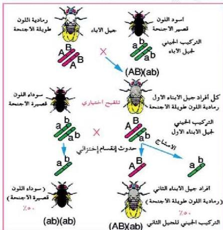

## وراثة مجموعة الجينات المترابطة Linkage Group

– ما المقصود بالجينات المترابطة؟

– كيف يتم توارث الجينات المترابطة؟

لقد وجد أن الجينات الواقعة على الكروموسوم الواحد والمتقاربة لا تتوزع توزيعاً حراً (حسب قانون مندل الثاني) عند تكوين الأمشاج بل تورث معاً كمجموعة واحدة تسمى المجموعة المترابطة، وقد توصل العالم مورجان Morgan (١٨٦٦-١٩٤٥م)، أثناء دراسته لتوارث بعض الصفات في ذبابة الفاكهة إلى أن هناك نوعين من الارتباط هما:

### الارتباط التام: Complete Linkage

في تجربة لدراسة توارث صفتي لون الجسم وحجم الأجنحة في ذبابة الفاكهة؛ زاوج مورجان بين أنثى من النوع البري رمادية اللون وذات أجنحة طويلة (نقية)،

وذكر أسود اللون ذي أجنحة قصيرة من النوع الناتج عن طفرة وراثية، كما في (الشكل ١٩)، ولأحظ الناتج من أفراد الجيل الأول.
– ما لون أجسام أفراد الجيل الأول؟
– ما الشكل الظاهري لأجنحتها؟

الشكل (١٩) توارث صفتي طول الأجنحة ولون الجسم في ذبابة الفاكهة عن طريق الارتباط التام للجينات.

الأحياء للصف الثالث الثانوي

http://E-learning-moe.edu.ye

١٢٥