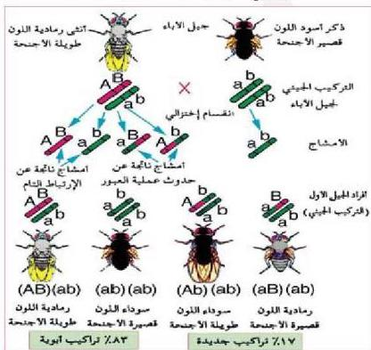

ثم قام مورجان بإجراء تلقيح اختباري بين ذكر رمادي اللون طويل الأجنحة من أفراد الجيل الأول وأنثى سوداء قصيرة الأجنحة كما في الشكل (١٩) ولأحظ صفات اللون وطول الأجنحة بين الأبناء فوجد أن ٥٠٪ من الأفراد كانت رمادية اللون طويلة الأجنحة و ٥٠٪ منها كانت سوداء اللون وقصيرة الأجنحة (بنسبة ١:١).
- قارن بين هذه النتائج والنتائج المتوقعة تبعاً لقانون التوزيع المندلي؟
- ما سبب ظهور الصفات بنسبة ١:١ مختلفة عن نسب قانون التوزيع الحر؟
وضع مورجان تفسيراً لهذه النتائج بأن كلاً من جين لون الجسم الرمادي وجين الأجنحة الطويلة موجود على أحد الكروموسومات، بينما توجد جينات لون الجسم الأسود والأجنحة القصيرة على الكروموسوم الآخر المقابل، ولهذا ينتقل الجينان معاً كما في الشكل (١٩).

## ٢- الارتباط غير التام للجينات : Incomplete Linkage

عندما كرر العالم مورجان التلقيح الاختباري، يتزوج أنثى هجينة رمادية اللون وطويلة الأجنحة مع ذكر أسود اللون وقصير الأجنحة كما في الشكل (٢٠)، لاحظ أن النتائج كانت أيضاً مخالفة للنسب التي اقترحتها قانون التوزيع الحر المندل.

- ما الأشكال الظاهرية للون الجسم وطول الأجنحة في أفراد الجيل الأول من ذباب الفاكهة؟
- ما مدى تشابه أفراد الجيل الأول مع الأبوين؟
لقد وجد مورجان أن نسبة الأفراد التي تشبه الأبوين في صفتي

الشكل (٢٠) توارث لون الجسم وطول الأجنحة في ذباب الفاكهة

١٢٩

الأحياء للصف الثالث الثانوي

http://E-learning-moe.edu.ye