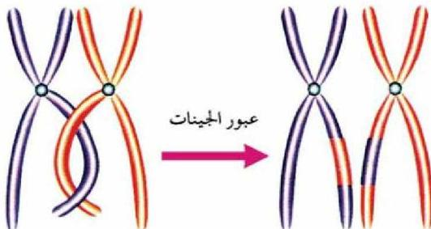

اللون وطول الأجنحة كانت حوالي ٨٣٪ بينما نسبة الأفراد التي لها صفات مختلفة عن الأبوين حوالي ١٧٪.

وقد علل مورجان ظهور أفراد بصفات مختلفة عن صفات الأبوين بحدوث عبور بين الجينات أثناء عملية الانقسام الاختزالي كما في الشكل (٢١) رغم وجودها على كروموسوم واحد.

- ما المقصود بالعبور للجينات؟

لقد لاحظ العلماء أنه بالرغم من أن الجينات الموجودة على أحد الكروموسومات تنتقل مترابطة من جيل الآباء إلى جيل الأبناء إلا أنه يحدث أحياناً انفكاك لبعض الجينات فتنتقل من الكروموسوم الذي يحملها إلى الكروموسوم المقابل له في عملية تسمى العبور كما في الشكل (٢١)، وينتج عن ذلك تغير في الصفات المرتبطة بتلك الجينات.

- ما أهمية العبور للكائنات الحية؟

- كيف تتم عملية العبور للجينات من كروموسوم إلى آخر؟

الشكل (٢١) عبور الجينات بين كروموسومين متجاورين

١٢٧

الأحياء للصف الثالث الثانوي

http://E-learning-moe.edu.ye