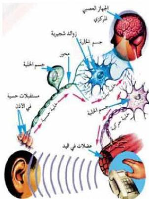

عن جسم الخلية حيث يتفرع جانبياً، ويعطي أفرعاً دقيقة عدة تنتهي بنهايات منتفخة تسمى الأزرار التشابكية Synaptic Knobs.

تصنف الخلايا العصبية على أساس عدد الزوائد الخارجة من جسم الخلية إلى ثلاثة أنواع هي:

١- خلايا عصبية أحادية القطب، ومنها يخرج من جسم الخلية زائدة واحدة قد تنقسم إلى فرعين أحدهما محور، والآخر زائدة شجيرية، مثل الخلايا الحسية.
٢- خلايا عصبية ثنائية القطب، ويخرج من جسم الخلية زائدتان، مثل خلايا شبكية العين.
٣- خلايا عصبية عديدة الأقطاب، وهي أكثر الخلايا انتشاراً في الجهاز العصبي، مثل الخلايا العصبية الحركية.

- لاحظ الشكل (٥) الذي يبين تصنيف الخلايا العصبية وظيفياً.

- سمّ الخلية العصبية التي تستقبل المؤثرات من البيئة المحيطة، وتنقلها إلى الجهاز العصبي المركزي.

- ما الخلية العصبية التي تنقل السيل العصبي من الجهاز العصبي المركزي إلى أعضاء الاستجابة؟

لاحظ أن الخلية التي توجد في الجهاز العصبي المركزي، وتصل بين

الشكل (٥) أنواع الخلايا العصبية حسب الوظيفة. الخليتين الحسية، والحركية تدعى الخلية البينية Inter Neuron.

### خلايا الغراء العصبي : Neuroglia

ما أنواع خلايا الغراء العصبي؟ وما وظيفتها؟

تشكل هذه الخلايا غالبية خلايا الجهاز العصبي ولها القدرة على الانقسام. ولكي تتعرف على أنواعها، لاحظ الجدول: (٢).

الأحياء للصف الثالث الثانوي

١٣

http://E-learning-moe.edu.ye