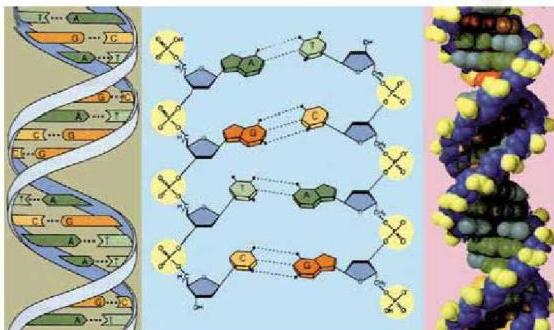

# الوراثة الجزيئية

## Molecular Genetics

# الوحدة الخامسة

### أهداف الوحدة

يتوقع منك بعد دراستك لهذه الوحدة أن تكون قادراً على أن:

1- توضح التركيب البنائي للكروموسوم والجين والحمض النووي الرايبوزي منقوص الأكسجين DNA.
2- تصف كيفية تضاعف حمض DNA. ونسخ حمض RNA.
3- تصف خطوات بناء البروتين في الخلية.
4- تعطي أمثلة لبعض تطبيقات الوراثة الجزيئية.

الأحياء للصف الثالث الثانوي

١٣١

http://E-learning-moe.edu.ye