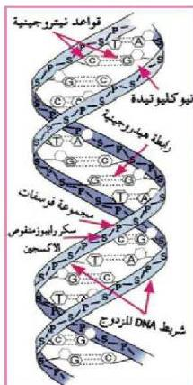

يعرف العلم الذي يختص بدراسة أهمية جزيئات DNA في مختلف جوانب حياة الكائنات الحية باسم علم الوراثة الجزيئية Molecular Genetics.

## اكتشاف التركيب البنائي لجزيء DNA :

توصل العالم أوزوالد أفري Oswald Avery ومساعدوه (ماك كارتي، وماكلاود) عام ١٩٤٤م إلى أن الحمض النووي الرايبوزي منقوص الأكسجين DNA هو المادة الوراثية في خلايا الكائن الحي. واستمرت الدراسات على هذا الحمض لسنوات عديدة إلى أن جاء اكتشاف تركيبه البنائي على يد كل من جيمس واطسون James Watson وفرانسيس كريك Francis Crick في عام ١٩٥٢م، بعد دراسة جميع المعطيات المعروفة عن هذا الحمض، وخاصة بعد حصولهما على صورة بالأشعة السينية للحمض النووي DNA كانت قد التقطتها روزا ليندا فرنكلين وقد توصل واطسون وكريك إلى أن للحمض النووي تركيب سلمي مؤلف من شريط حلزوني مزدوج (الشكل ١) يتكون كل منهما من سلسلة من النيوكليوتيدات. وتتألف كل نيوكليوتيدة مما يأتي:

أ - مجموعة فوسفات.

ب - سكر الرايبوز منقوص الأكسجين.

ج - قاعدة نيتروجينية.

وهناك أربعة أنواع من القواعد النيتروجينية تدخل في تركيب DNA، وهي كما يأتي:

١ - أدينين Adenine ويرمز له بالحرف A.

٢ - جواتين Guanine ويرمز له بالحرف G.

٣ - سايتوسين Cytosine ويرمز له بالحرف C.

٤ - ثالين Thymine ويرمز له بالحرف T.

وتترتب القواعد النيتروجينية في شريط DNA على هيئة درجات السلم الحلزوني بحيث يرتبط C مع G بثلاثة روابط هيدروجينية كما يرتبط A مع T برابطتين هيدروجينيتين. الشكل (١)

الشكل (١) جزء من شريط DNA المزدوج

الأحياء الصف الثالث الثانوي

http://E-learning-moe.edu.ye

١٣٣