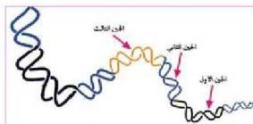
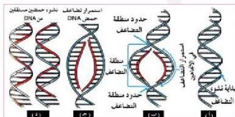

– ما هو تعريف الجين؟ وم يتكون؟
يمكن تعريف الجين بأنه وحدة وراثية يمثلها موقع محدد على جزيء الحمض

الشكل (٢) الجينات على شريط DNA

النووي الرايبوزي منقوص الأكسجين DNA، وهو يتكون من سلسلة محدودة من النيوكليوتيدات، كما هو موضح في الشكل (٢).

# تضاعف الحمض النووي DNA

عرفت أن الخلية الحية حقيقية الدواة تنقسم مكونة خليتين مماثلتين للخلية الأصلية، ولعلك تتذكر أن للخلية دورة تسمى دورة الخلية Cell Cycle تحدث خلالها تغيرات واضحة في الخلية.

– سمِّ المراحل الثلاث التي تسبق الانقسام الخيطي Mitosis.

– في أي مرحلة من المراحل الثلاث يتضاعف حمض DNA؟

انظر الشكل (٣) الذي يبين ميكانيكية تضاعف حمض DNA، والتي تحدث على النحو الآتي:

الشكل (٣) تضاعف حمض DNA

١- في البداية تفصل الروابط الهيدروجينية بين القواعد النيتروجينية عند نقاط معينة على امتداد جزيء DNA وتسمى كل من هذه

النقاط منشأ التضاعف Origin of Replication، (شكل ١٣-١)، ويحدث ذلك بفعل بروتينات معينة وانزيمات خاصة تسمى (هيليكيسيز) Helicases. وتجدر الإشارة إلى أن هناك المئات، بل والآلاف أحياناً، من نقاط منشأ التضاعف على امتداد جزيء DNA للتضاعف.

١٣٤

الأحياء: النصف الثالث الثانوي

http://E-learning-moe.edu.ye