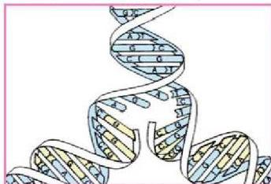

٢- تبدأ عملية تضاعف الحمض النووي من نقاط منشأ التضاعف العديدة وتستمر في اتجاهين متضادين على كل نقطة، ويبين الشكل (٤) هذه العملية كما تحدث في منشأ تضاعف واحد.

٣- تستمر عملية التضاعف في جميع نقاط المنشأ إلى أن يكتمل تضاعف جزيء حمض DNA، علماً بأن عملية التضاعف تتم بفعل إنزيمات بلمرة حمض DNA

الشكل (٤) حمض DNA أثناء التضاعف

ويمثل الشكل (٤) شريطي الحمض النووي DNA أثناء عملية التضاعف. ولاحظ أن شريطي الحمض النووي DNA الأصليين (باللون الأزرق) يمثلان قاليين يعمل كل منهما على بناء شريط جديد (باللون الأصفر).

# **النقاط (١)**

• قارن تسلسل القواعد النيتروجينية على الشريطين الجديدين بتسلسلهما على الشريطين الأصليين. فماذا تلاحظ؟

# **دور حمض DNA في نقل الصفات الوراثية:**

أوضحت نتائج العديد من الدراسات في الوراثة الجزيئية أن جزيء حمض DNA يحمل الشفرات التي تحتوي على التعليمات الخاصة بتركيب ووظائف مكونات الكائن الحي. إضافة إلى ذلك، توصل العلماء إلى أن هذه التعليمات تحملها حموض نووية أخرى ليتم في ضوئها بناء وتركيب المكونات المختلفة لجسم الكائن الحي مثل الحموض الأمينية في البروتينات.

- هل تذكرت اسم الحمض النووي الآخر ورمزه؟
- كيف يمكن لحمض DNA بقواعده النيتروجينية الأربع أن يحدد تسلسل الحموض الأمينية التي يبلغ عددها عشرين في جزيء البروتين؟
- لقد اتضح أن الحمض النووي الآخر الذي يقوم بهذا العمل هو الحمض النووي الرايبوزي RNA.

الأحياء للصف الثالث الثانوي

١٣٥

http://E-learning-moe.edu.ye