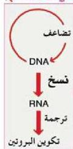

## الحمض النووي الرايبوزي RNA :

– ما الفرق بين الحمض النووي الرايبوزي RNA والحمض النووي الرايبوزي منقوص الأكسجين DNA ؟

توصل العلماء إلى عدد من الأدلة التي تبين أن حمض RNA قد يكون له دور في ترجمة المعلومات الجينية التي يحملها جزيء حمض DNA إلى سلسلة من المحموض الأمينية ليكون منها سلسلة الببتيد العديد Polypeptide، ومن هذه الأدلة :

١- وجود حمض RNA بكثرة في سيتوبلازم الخلية، وهو المكان الذي تصنع فيه الخلية البروتينات .

٢- وجود كميات كبيرة من حمض RNA في خلايا الأجنة النامية . ماذا تستنتج من ذلك ؟
٣- تحتوي الخلايا التي تصنع البروتينات على كميات وفيرة من الرايبوسومات، علماً بأن الرايبوسومات تمثل ثلثي جزيء حمض RNA .

– ما دور الرايبوسومات في الخلية ؟

قدم العالم فرانسيس كريك مقترحاً أسماه ( وجهة النظر المركزية Central Dogma )،

والذي يتلخص في أن حمض DNA يتضاعف ، وهو الذي يقوم بنسخ حمض mRNA ، الذي يقوم بدوره بترجمة المعلومات إلى المواد البروتينية، ويبين الشكل ( ٥ ) مخططاً لهذا المقترح .

– ولكن، كيف يتم نسخ حمض RNA ، وكيف تصنع الخلية البروتين ؟
إن الاختلاف الجوهري بين حمض DNA وحمض RNA يتمثل فيما يأتي :

أ – يكون حمض DNA بهيئة شريط مزدوج حلزوني بينما يكون حمض RNA بهيئة شريط مفرد .

ب – تدخل أربعة قواعد نيتروجينية في تركيب كل منهما . ثلاثة من هذه القواعد مشتركة بينهما وهي : أدينين (A) وجوانين (G) وسايثوسين

(C) ويختلفان في القاعدة الرابعة؛ حيث تكون ثامين (T) في DNA بينما تكون يوراسيل (U) Uracil في حمض RNA .

وهناك ثلاثة أنواع من حمض RNA في خلايا الكائنات الحية، يتم نسخها من حمض DNA ويؤدي كل نوع منها دوراً معيناً في خطوات بناء البروتين في الخلية، وهذه الأنواع هي :

الشكل ( ٥ )
وجهة النظر المركزية

١٣٦

الأحياء للصف الثالث الثانوي

http://E-learning-moe.edu.ye