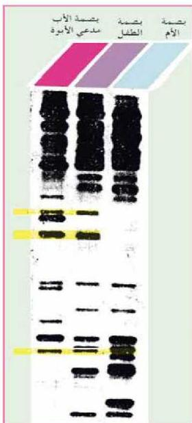

الشكل (٩) بصمة الحمض النووي

انظر إلى الشكل رقم (٩) والذي يمثل بصمة DNA ثلاثة أشخاص، أم وطفل، ورجل يزعم أنه أب للطفل، وللتحقق من ذلك أجريت مقارنة لبصمة DNA لكل منهم. تلاحظ أن أي خط لا يتطابق مع بصمة الأم، ولكنه يتطابق مع بصمة الرجل، فإن ذلك يثبت أن الرجل أب للطفل كما يتضح ذلك من الخطوط المعلقة باللون الأصفر.

تجدر الإشارة إلى أنه يمكن استخدام بصمة الحمض النووي DNA في التحقق من هوية مجرم إذا ترك أثراً من نسيج حي من جسمه، كقطرة دم أو شعرة مثلاً، وذلك بإعداد بصمة DNA من هذا النسيج ومطابقتها مع الأشخاص المشتبه بهم لإثبات أو نفي ارتكابهم للجريمة.

الأحياء للصف الثالث الثانوي

http://E-learning-moe.edu.ye

١٤١