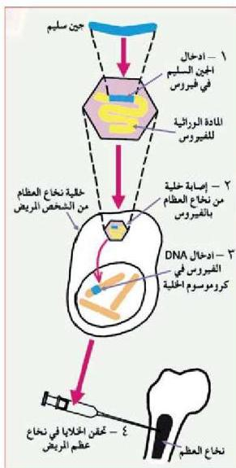

## ٢- علاج أو إصلاح الجينات : Gene Therapy

تمكن العلماء باستخدام تقنية الهندسة الوراثية من علاج أو إصلاح بعض أنواع الخلل التي تحدث في بعض الجينات. فإذا كان هناك شخص يعاني من مرض جيني معين يمكن تحديده وتشخيصه، فإن بالإمكان استبدال ذلك الجين بآخر سليم، وذلك باستنساخ الجين السليم من شخص آخر وزرعه في خلية لها القدرة على الانقسام بصورة مستمرة، كخلايا نخاع العظم.

الشكل (١٠) علاج أو إصلاح الجينات

تتبع كيفية إجراء هذه التقنية في الشكل (١٠) والتي أجريت لشخص لا يستطيع نخاع عظامه إنتاج أحد البروتينات الحيوية. لاحظ أن العملية تجري على النحو الآتي:

١- إدخال الجين السليم في فيروس غير ممرض من النوع الذي يستطيع بناء حمض DNA باستعمال قالب RNA.
٢- إدخال الفيروس في خلية نخاع العظم.
٣- دخول حمض DNA الذي بناه الفيروس إلى كروموسوم الخلية.
٤- حقن الخلايا الحاملة للجين السليم في جسم المريض وبعد ذلك يستطيع نخاع العظم الذي تم علاجه إنتاج البروتين المطلوب.

١٤٢

الأحياء للصف الثالث الثانوي

http://E-learning-moe.edu.ye