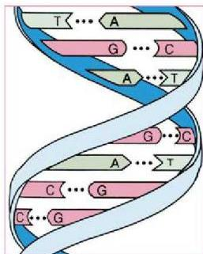

هامة في تطور عمليات الاستفادة من التقنية الحيوية لمساعدة الإنسان.

– من مكشوف البنسلين؟ وكيف تم اكتشافه؟

ويتم حالياً إنتاج البنسلين بصورة تجارية في أنحاء مختلفة من العالم.

استمرت عملية التطور لإنتاج مواد مختلفة اعتماداً على التقنية الحيوية،

الشكل (٢) حمض DNA في الكائنات الحية

خلال النصف الثاني من القرن العشرين، وبدأ التطور المتسارع للتقانة الحيوية منذ بداية عقد السبعينات نتيجة لتركيز العلماء والباحثين على الحمض النووي DNA والجينات المكونة له في الكائنات الحية، وخاصة الكائنات الحية الدقيقة كالبكتيريا، واستخدام الهندسة الوراثية أو الجينية في إضافة أو حذف جين أو أكثر من حمض DNA للكائن الحي، حتى يمكن الاستفادة منه في صناعة منتجات متنوعة وخاصة في مجال الغذاء والأدوية كإنتاج هرمون الانسولين وهرمون النمو مثلاً.

– لم يتكون حمض DNA؟

– كيف يتم إنتاج الحموض الأمينية؟ والبروتينات عن طريق الحموض النووية؟

## الهندسة الجينية أو الوراثية :

تعد الهندسة الوراثية أو الجينية من أحدث التقنيات في مجال علوم الحياة في عصرنا الحديث. وقد بدأ العلماء تطوير هذه التقنية في السبعينات من القرن العشرين ومنذ ذلك الوقت تطورت الهندسة الوراثية تطوراً متسارعاً، وأخذت استخدامات التقنيات الحيوية المرتبطة بها في الانتشار والاتساع في مجالات متعددة، حتى أصبحت كثير من الصناعات والمنتجات الهامة لحياة الإنسان تعتمد اعتماداً كلياً على هذه التقنية.

وتستند الهندسة الوراثية على علم الحياة الجزيئي Molecular Biology

١٤٦

الأحياء النصف الثالث الثانوي