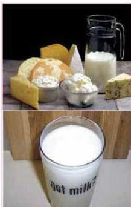

شكل (٣)
أنواع من منتجات الزبادي والجبن

الجبن واللبن (الحقين والرائب) أطعمة ينتجها الرعاة والمزارعون، الذين يهتمون بتربية الأغنام والأبقار منذ مئات السنين. ويتم إنتاج هذه الأطعمة عن طريق تخمير حليب الأبقار والأغنام بواسطة بعض أنواع من البكتيريا. وكان المزارعون ورعاة الأغنام والأبقار (وحتى الآن) يقومون بإنتاج الحقين والزبادي والجبن عن طريق إضافة كمية بسيطة من حقين أو زبادي سابق إلى الحليب الجديد وتركه فترة من الوقت، ثم تتبع بعض الإجراءات المختلفة حتى يتحول الحليب إلى حقين أو زبادي أو جبن بحسب الطلب.

– ما الذي يحويه الحقين أو الزبادي المضاف إلى الحليب؟

# النشاط (١)

• نفذ النشاط الخاص بإنتاج الزبادي في كتاب الأنشطة والتجارب العملية.

إن عملية إنتاج الحقين والزبادي والجبن تتم هذه الأيام في مصانع متخصصة، حيث يتم إنتاج كميات كبيرة منها وفق طرق علمية حديثة يتم التحكم بها آلياً. والخطوات التي تتبع عادة في إنتاج الزبادي صناعياً كما يأتي:

١- يتم التأكد من تعقيم كل الأواني والأدوات التي سيتم معالجة الحليب فيها لتحويله إلى زبادي.
٢- يحضر الحليب، بحيث يتم التحكم في نسبة المواد الدهنية والمواد البروتينية فيه بحسب رغبة المستهلك (إنتاج زبادي مع الدهون أو خالٍ من الدهون).
٣- يتم التأكد من خلط الدهن جيداً في الحليب، حتى لا يجتمع ويتفصل عنه أثناء عملية الإنتاج.
– ما فائدة قيام المرأة في الريف بخض الحليب لفترة طويلة من الوقت؟
٤- تتم بسترة الحليب.
– وضع الخطوات التي تتم بها بسترة الحليب؟
– ما أهمية عملية البسترة للحليب؟

١٤٨

الأحياء: النصف الثالث الثانوي