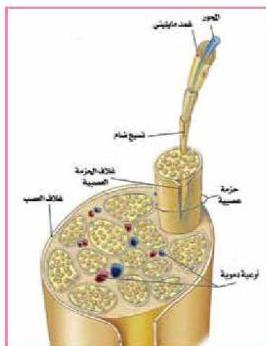
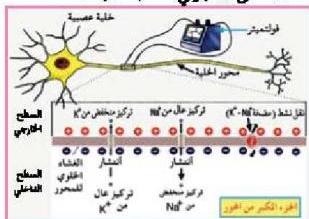

الشكل (٦) تركيب العصب.

بتسيج ضام، غني بالأوعية الدموية مكونة حزمة عصبية، ومجموعة الحزم العصبية المحاطة بغلاف سميك تسمى العصب. الشكل (٦).

# - السيل العصبي: Nerve Impulse

عرفت سابقاً أن الخلايا العضلية تقوم بالانقباض، والخلايا الغدية بالإفراز، بينما الخلايا العصبية تخصصت في توليد السيلالات العصبية ونقلها. والسيل العصبي هو لغة التفاهم بين الخلايا العصبية، وهو الشكل الذي تترجم إليه أنواع المؤثرات جميعها التي يتأثر بها الجسم، وقد تم معرفة آلية تكوين السيل العصبي وانتقاله من خلال دراسات تجريبية على محاور عصبية لحيوان الخبار (Sepia).

- كيف يتكون السيل العصبي؟ وكيف ينتقل؟

يتولد السيل العصبي عند حدوث مؤثر ما في الخلية العصبية، ولكي نفهم كيفية تكونه علينا التعرف على وضع غشاء الخلية العصبية قبل حدوث أي مؤثر؛ عندما تكون في وضع يسمى جهد الراحة. بالمعنى الكهربائي لكمية الجهد.

- فما المقصود بجهد الراحة؟

# - جهد الراحة

# :Resting Potential

لاحظ الشكل (٧) حيث ستجد أن الخلية العصبية محاطة بغشاء ذو نفاذية اختيارية يفصل بين البيئة الداخلية والخارجية لهذه الخلية.

الشكل (٧) قياس جهد الراحة.

- ما نوع الشحنات داخل وخارج الخلية العصبية؟ تختلف الشحنات داخل الخلية عن الشحنات خارجها، ويرجع اختلاف توزيع الشحنات على جانبي غشاء الخلية العصبية إلى الآتي:

الأحياء للصف الثالث الثانوي

١٥

http://E-learning-moe.edu.ye