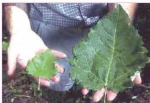
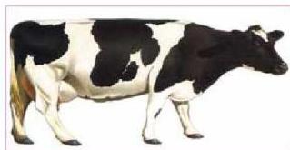

شكل (٦) النبات ذو الأوراق الكبيرة تم إنتاجه بواسطة الهندسة الوراثية

قيمة منتجاتها الغذائية، أو تكبير أوراقها كما في الشكل (٦). ويرى العلماء أن هذه التقنية ستساعدهم على اكتشاف وظائف آلاف الجينات للنباتات منتجة الغذاء، مما يجعل بالإمكان تحديد الجينات التي ينبغي حذفها من الكروموسومات أو إضافتها إليها،

كان تنتقل جينات من نبات إلى آخر لتحسين إنتاجه، مثل نقل جينات من البطاطس إلى الذرة. ولهذا فإن علماء التقنية الحيوية يشرون فقراء العالم بمنتجات غذائية رخيصة ولكنها تحمل قيمة غذائية عالية، إلا أن هناك معارضة قوية لاستخدام الأغذية المعدلة وراثياً خوفاً من أن يكون لها آثار ضارة على مستهلكيها.

شكل (٧) تحسين الإنتاج الحيواني

ويمكن أيضاً استخدام التقنية الحيوية في زيادة إنتاج الغذاء الحيواني، كان يتم نقل الجينات المسؤولة عن الإنتاج الوفير من الحليب من نوع من الأبقار يتميز بهذه الخاصية إلى نوع آخر يتميز

بإنتاج حليب أقل، فيزيد إنتاج الحليب لديها، أو لزيادة إنتاج اللحوم فيها. وجعلها أكثر وفرة وذات نوعية جيدة.

### استخدام التقنية الحيوية في إنتاج الدواء:

تساهم التقنية الحيوية هذه الأيام في إحداث تطور متسارع في الرعاية الصحية وتوفير الأدوية والمضادات الحيوية لمقاومة الأمراض. ومنذ أن تمكن الإنسان من اكتشاف تأثير البنسلين على أنواع من البكتيريا الممرضة واستخدامه كمضاد حيوي وإنتاجه بكميات تجارية في الأربعينيات من القرن العشرين، حصل تطور كبير في

١٥٢

الأحياء للصف الثالث الثانوي