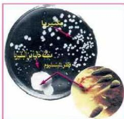

شكل (٨) تأثير البنسلين على البكتيريا

إنتاج المضادات الحيوية والهرمونات والأدوية بكميات كبيرة، وذات نوعيات فاعلة مما كان لها أكبر الأثر في مكافحة كثير من الأمراض ورفع المستوى الصحي للإنسان. لاحظ الشكل (٨):

- ما سبب وجود منطقة خالية من البكتيريا؟

- كيف يعمل المضاد الحيوي على الشفاء من المرض بإذن الله؟

والمضادات الحيوية المتنوعة عبارة عن مواد كيميائية يتم إنتاجها بواسطة كائنات حية دقيقة تعمل على مقاومة البكتيريا الممرضة عند دخولها جسم الإنسان، وشل حركتها ونشاطها، حتى يتم من القضاء عليها. ويكون تأثير بعض المضادات الحيوية مثل البنسلين محدوداً بينما البعض الآخر من المضادات الحيوية مثل الكلورامفنيكول يكون مدى تأثيرها واسعاً في وقف نشاط أنواع متعددة من البكتيريا الممرضة. وعلى الرغم من اكتشاف ما يقرب من (٥٠٠٠) مضاد حيوي إلا أن حوالي (١٠٠) منها فقط تستخدم بفاعلية في معالجة الأمراض والتهابات البكتيريا المعدية.

ويتم إنتاج المضادات الحيوية في معامل الإنتاج المخصصة لذلك، وفقاً لشروط ومعايير محددة. فمثلاً في إنتاج البنسلين يوضع مخلوط الفطريات المكونة من فطر بنسليوم ناتانوم وبنسيوليوم كريسوجينوم في أوعية خاصة تحت ظروف محددة، مثل درجة حرارة (٢٤ درجة مئوية)، وإمداد مناسب من الأكسجين، ووسط يميل قليلاً إلى القاعدية، حيث تبدأ الفطريات في إنتاج البنسلين بعد حوالي (٣٠) ساعة ويصل أقصى حد للإنتاج بعد حوالي أربعة أيام، ثم يبدأ بالتناقص حتى يتوقف بعد حوالي ستة أيام، وبعد ذلك يتم ترشيح المخلوط لتجميع السائل في وعاء خاص، ويكون محتوياً على البنسلين الذي يتم تنقيته باتباع بعض العمليات الكيميائية، ليصبح بعد ذلك جاهزاً للاستخدام.

١٥٣

الأحياء للصف الثالث الثانوي