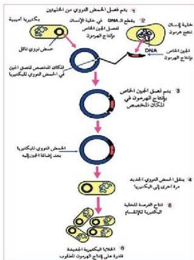

ومع زيادة مقاومة البكتيريا للمضادات الحيوية تابع العلماء بحشهم عن أنواع جديدة منها تكون أكثر فاعلية. وقد بدأ الاتجاه نحو الاستعانة بهندسة الجينات وتعديل جينات بعض الكائنات الحية، بحيث تصبح هذه الكائنات الحية المعدلة جينياً قادرة على إنتاج مضادات حيوية أكثر قوة وفاعلية، وقد ساعد ذلك في إنتاج مضادات أخرى غير البنسلين، مثل الاستربتومايسين والكلورامفينكول، وغيرها. وتستخدم ثقافة هندسة الجينات الآن في إعادة تشكيل الحمض النووي (DNA) للكائنات

شكل (٩) آلية إنتاج الهرمونات بواسطة الهندسة الوراثية الدقيقة - في إنتاج أنواع متعددة من الهرمونات، مثل هرمون النمو، وهرمون الإنسولين في خطوات محددة كما في الشكل (٩)، والذين كانا يستخلصان في السابق من أنسجة الحيوانات. فبالنسبة لإنتاج الأنسولين فإنه يؤخذ الجين المسؤول عن بناء الهرمون وإنتاجه في جسم الإنسان من الخلية البشرية وينقل إلى الحمض النووي (DNA) في الخلية البكتيرية كما في الشكل (٩) ثم يتم وضع الكائنات الدقيقة في أوعية خاصة تتعرض فيها لظروف ملائمة؛ حيث تتكاثر هذه الكائنات وتنتج الهرمون المطلوب، ثم يمر الهرمون بعدة عمليات معقدة لتنقيته، وجعله جاهزاً للاستخدام، ومن أهم الهرمونات التي يتم إنتاجها بهذه الطريقة هرمون الأنسولين الذي يستخدمه مرضى السكر، وهرمون النمو الذي يستخدم لمعالجة القزامة. كذلك يتم حالياً إنتاج بعض المركبات الهرمونية مثل الكورتيزون، والهرمونات التناسلية، مثل التيتستوستيرون والاستروجين.

كما يتم إنتاج الهرمونات التي تستخدم في زيادة الإنتاج الحيواني مثل هرمون البوفين سوماتوثرافين Bovine Somatotrophin (BST) الذي يعطى للإبقار لزيادة إنتاج الحليب منها.

١٥٤

الأحياء: النصف الثالث الثانوي