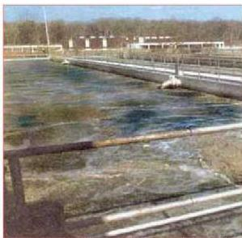

## استخدام التقانة الحيوية في معالجة المخلفات الملوثة :

تتواصل محاولات العلماء في استخدام الكائنات الدقيقة في تحليل كثير من المخلفات والمواد الملوثة للبيئة والتخلص من أضرارها البيئية مثل: مخلفات الصرف الصحي والمخلفات البلاستيكية والمخلفات النفطية وغيرها.

شكل (١٠) إنتاج غاز الميثان من مخلفات الصرف الصحي

فبالنسبة لمخلفات المجاري فإنه يتم استخدام الكائنات الدقيقة مثل البكتيريا بشكل فاعل لتحليل مخلفات الصرف الصحي في محطات معالجة مجاري مياه الصرف الصحي وتحويلها إلى مواد غير ضارة، بل يمكن الاستفادة منها في أغراض مختلفة، مثل الوقود. والأهم من كل ذلك أن تحليل مخلفات المجاري والصرف الصحي يساعد على تخليص البيئة

من ملوث رئيسي لها. ويتم التحليل الحيوي التخميري إما في وجود الأوكسجين أو في عدم وجوده. وتتمثل خطوات التحليل الحيوي لهذه المخلفات في عدم وجود الأكسجين، بأن يتم أولاً تجميع المخلفات في أحواض في صورة طينية بعد فصل الجزء الأكبر من الماء في أحواض أخرى، وتضاف الكائنات الحية الدقيقة إلى الأحواض التي تحوي المخلفات في شكلها شبه الصلب وترفع درجة الحرارة فيها إلى حوالي ٢٥ درجة مئوية، لتبدأ بكتيريا التحليل نشاطها الحيوي التخميري (تنفس لاهوائي)، حيث تعمل على تحويل المواد العضوية للمخلفات إلى حموض دهنية وحموض أمينية وسكريات أحادية، ثم تنشيط أنواع أخرى من البكتيريا لتحويل هذه النواتج إلى حموض عضوية ومواد كحولية، ومن ثم تنشيط أنواع أخرى من البكتيريا (Methanogenic) لتحويلها إلى غاز الميثان ($CH_4$) والماء، إذ يمكن استخدام الميثان كوقود.

١٥٦

الأحياء للصف الثالث الثانوي