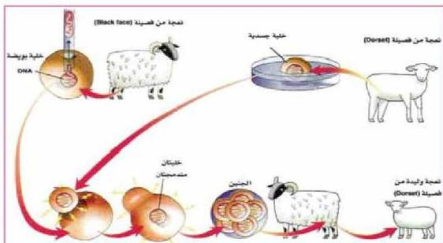

الشكل (١٢) خطوات استنساخ - النعجة دوللي

١- وضعت خلية مأخوذة من ضربة نعجة (Dorset) في وسط غذائي فقير جداً بالمواد الغذائية وأدى تجميع الخلية إلى وقف انقساماتها وجيناتها النشطة، مع بقاء نواتها سليمة.
٢- في تلك الأثناء أخذت بويضة غير مخصبة من نعجة (Black face) ثم انتزعت منهما النواة بما فيها DNA، وبقيت بويضة فارغة تحوي كل المواد اللازمة لإنتاج جنين.
٣- وضعت الخلية الجسدية بجانب البويضة (الخلية التناسلية)، ثم أطلق نبض كهربائي حاكي النشاط الكيميائي والبيولوجي الطبيعي أثناء عملية الإخصاب، فاندمجت نواة الخلية الجسدية مكان نواة البويضة المنزوعة كأي بويضة مخصبة (لاقحة).
٤- بعد حوالي ستة أيام زرع الجنين الناتج في رحم نعجة أخرى من فصيلة (Black face).
٥- بعد فترة الحمل ولدت نعجة (Black face) نعجة من فصيلة (Dorset) أطلق عليها (دوللي) والتي تماثل في صفاتها الوراثية النعجة التي أخذت منها الخلية الجسدية.

الأحياء للصف الثالث الثانوي

١٥٩