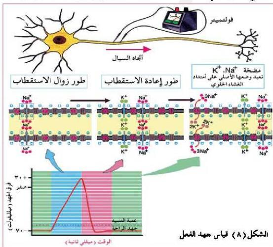

١- وجود بروتينات سالبة الشحنة داخل الليفة العصبية لا تستطيع أن تنفذ إلى خارجها.
٢- عمل مضخة صوديوم - بوتاسيوم ؛ حيث تخرج أيونات الصوديوم Na+ وتدخل أيونات البوتاسيوم K+ التي تنتقل عبر الغشاء الخلوي بطريقة النقل الإيجابي (النشط).
لاحظ أن سطح الليفة الخارجي مشحون بشحنة موجبة، والسطح الداخلي مشحون بشحنة سالبة، ويطلق على هذه الحالة بالاستقطاب Polarization ويسمى مقدار فرق الجهد بين داخل الليفة العصبية وخارجها في هذه الحالة بجهد الراحة ويكون مقداره (٧٠) ميلي فولت. إلا أن هناك جهداً آخر يسمى جهد الفعل يحدث عند تأثر الخلية العصبية بمؤثر خارجي.

# - جهد الفعل : Action Potential

- ما المقصود بجهد الفعل؟

- ماذا يحدث لليفة العصبية عند تأثرها بمؤثر؟

تتبع التغيرات التي تحدث لليفة العصبية ملاحظة الشكل (٨) ودراسة الجدول (٣).

١٦

الأحياء للصف الثالث الثانوي

http://E-learning-moe.edu.ye