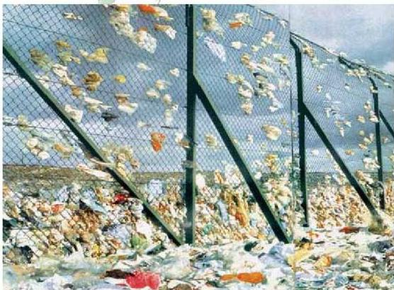

الوحدة السابعة

البيئة ومشكلاتها

# أهداف الوحدة

يتوقع منك بعد دراستك لهذه الوحدة أن تكون قادراً على أن:

١- توضح المقصود بكل من : البيئة - النظام البيئة - الاحتباس الحراري - الانعكاس الحراري
٢- توضح مراحل تطور علاقة الإنسان بالبيئة.
٣- تتعرف على أهم المشكلات التي تتعرض لها البيئة ومصادرها وأنواعها.
٤- تبين أهم الموارد البيئية التي تتعرض للاستنزاف.
٥- تتوصل إلى بعض الحلول لمشكلات استنزاف المياه والتربة والغطاء النباتي.
٦- تقترح بعض المعالجات للمشكلات البيئية في بلادنا.

١٦٢

الأحياء للصف الثالث الثانوي