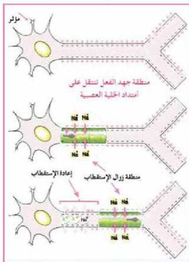

# جدول (٣) التغيرات التي تحدث لليفة العصبية عند تأثرها بمؤثر

|  اسم المرحلة | التغيرات التي تحدث في الليفة العصبية  |
| --- | --- |
|  زوال الاستقطاب Depolarization | وصول مؤثر لمنطقة التأثير يؤدي إلى توقف مضخة صوديوم - بوتاسيوم، وفتح قنوات الصوديوم في غشاء الليفة العصبية فتنتشر أيونات الصوديوم إلى داخل الليفة فيرتفع الجهد الداخلي لها إلى (٣٠+) ميلي فولت، وعندما تغلق قنوات الصوديوم.  |
|  إعادة الاستقطاب Repolarization | عند إغلاق قنوات الصوديوم تفتح قنوات البوتاسيوم الموجودة على غشاء الليفة العصبية، فتنتشر أيونات البوتاسيوم وينخفض فرق الجهد لليفة العصبية.  |

لاحظ أن التغيرات الكهربائية التي ترافق زوال الاستقطاب، وإعادته، يطلق عليها جهد الفعل، وهنا يمكن أن يعرف السيل العصبي بأنه موجة من إزالة الاستقطاب تسري في محور الخلية العصبية بعد تنبيه تلك الخلية، ويصاحبها تكون جهد فعل عند نقاط متعددة على طول المحور.

– كيف تعود الليفة العصبية إلى جهد الراحة؟

بعد اختفاء جهد الفعل تعمل مضخة الصوديوم - بوتاسيوم على إعادة الليفة العصبية إلى حالة الاستقطاب بإخراج أيونات الصوديوم وإدخال أيونات البوتاسيوم لتعود الخلية إلى وضعها في جهد الراحة.

■ آلية انتقال السيل العصبي في الألياف العصبية :

انظر الشكل (٩)، ولاحظ كيف ينتقل السيل العصبي في الألياف العصبية غير المليئة ينتقل بطريقة التأثير الدائري الموضعي.

الشكل (٩) انتقال السيل العصبي في الألياف غير المليئة بطريقة التأثير الدائري الموضعي.

الأحياء للصف الثالث الثانوي

١٧

http://E-learning-moe.edu.ye