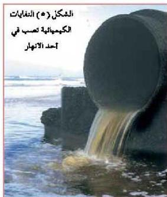

## ثانياً: تلوث الماء Water Pollution

الماء أساس الحياة لجميع أنواع الكائنات الحية من إنسان أو حيوان أو نبات تصديقاً لقوله تعالى: ﴿ وَجَعَلْنَا مِنَ الْمَاءِ كُلَّ شَيْءٍ حَيٍّ ﴾ (الأنبياء: ٣٠)، فالماء يدخل في بناء أجسام الكائنات الحية، كما يعتبر وسطاً مهماً لكل التفاعلات التي تحدث في جسم الكائن الحي، كما أنه يعد مكاناً مناسباً لحياة العديد من أنواع الكائنات الحية التي تعيش في البحار والمحيطات والأنهار والبحيرات وغيرها، إلا أنه في هذه الأيام أصبح يتعرض للملوثات مختلفة.

### مصادر تلوث المياه:

- ما مصادر تلوث المياه؟

يتعرض الماء إلى ملوثات مختلفة مثل الملوثات العضوية والحيوية (كائنات حية مسببة للمرض)، إضافة إلى المواد المترسبة والتلوث الحراري والإشعاعي وغيرها. لاحظ الشكل (٥).

وأهم مصادر التلوث للمياه ما يأتي:

١- مياه المجاري والصرف الصحي وما تحويه من مخلفات المنازل والمدارس والمعامل والمؤسسات والمصانع،

وجميعها تحتوي على مركبات عضوية قابلة للتحلل، إضافة إلى العوامل الممرضة كالبكتيريا والفيروسات والفطريات والديدان المحيطية وغيرها.

٢- المواد الكيميائية والمياه الناتجة عن الأنشطة الصناعية المختلفة والتي قد تكون ناتجة عن صناعات عضوية مثل صناعة الدواء والجلود والأقمشة، أو الناتجة عن الصناعة غير العضوية مثل الكسارات ومناشير قطع الأحجار.

٣- المخلفات النفطية والبترولية والتي ينتج عنها نفايات سامة تلوث البحار والمحيطات وغيرها من مصادر المياه.

٤- الأمطار الحمضية التي تنتج في المناطق الصناعية.

٥- الاستخدام العشوائي للأسمدة والمبيدات، وخاصة التي يدخل في صناعتها الزئبق الذي يعد من العناصر السامة؛ لأن المواد التي يدخل في صناعتها هذا العنصر قد تنتقل إلى المياه الجوفية فتلوثها.

الأحياء للصف الثالث الثانوي

http://E-learning-moe.edu.ye

١٧١