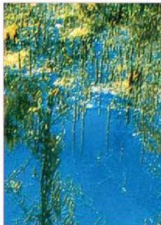
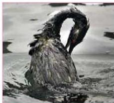

٦- التلوث الحراري الناتج عن استعمال المياه كمصدر للطاقة في محطات الكهرباء التي تدار بواسطة البخار أو الطاقة الذرية، أو استعمال المياه في تشغيل المعامل والمصانع في الأوساط المائية وجميعها تعمل على رفع درجة حرارة الماء فتقل نسبة الأوكسجين المذاب فيه، مما يؤثر على حياة الكائنات الحية التي تعيش فيه كالأوليات

الشكل (٦) تأثير الملوثات على النباتات

والطحالب والأسماك، وبشكل ذلك تهديداً مباشراً للحياة في المحيطات المائية، وقد يؤدي إما إلى وفاة الأحياء المائية، أو وقف تكاثرها أو هجرتها، وينتج عنه في النهاية تدمر هذا النظام البيئي وموت ما فيه من حيوان ونبات كما في الشكل (٦).

- ما المقصود بالنظام البيئي؟

- كيف تكون البيئة المائية نظاماً بيئياً متزناً؟

ومن الملوثات التي تؤثر بشكل كبير على البيئة المائية الملوثات النفطية.

### تأثيرات التلوث النفطي:

يحدث تلوث مياه البحار والمحيطات بالنفط

بسبب غرق السفن المحملة بالنفط الذي يطفو على سطح الماء ويكون طبقة رقيقة تعمل على عزل المياه عن الغلاف الجوي، ومنع التبادل الغازي بينهما، مما

الشكل (٧) تأثير التلوث النفطي على الحيوانات

يؤدي إلى نقص كمية الأكسجين المذاب في الماء. وقد يُغطى طن واحد من النفط ١٢ كم²، ويؤدي ذلك إلى قتل العديد من الكائنات المائية (الشكل - ٧)، كما يجعل هذه المياه غير صالحة للاستعمال. ويقضي هذا التلوث على مصدر مهم من مصادر غذاء الإنسان.

وتتلوث مياه البحار والمحيطات أيضاً بالعناصر الثقيلة مثل الرصاص الموجود في وقود وسائل النقل البحري، أو بالزئبق والزرنيخ

١٧٢

الأحياء للصف الثالث الثانوي