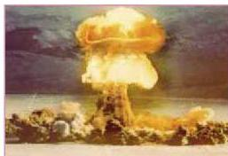
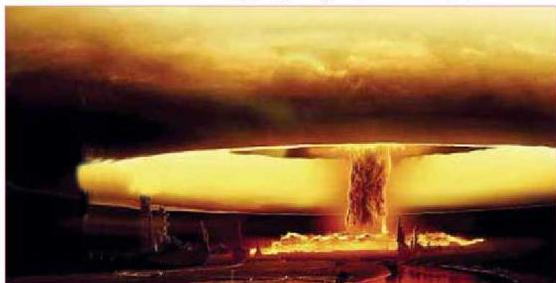

## رابعاً: التلوث الإشعاعي:

يعتبر التلوث الإشعاعي أخطر أنواع التلوث على الإطلاق وذلك لبقائه في البيئة لفترة زمنية طويلة جداً، وينتج التلوث الإشعاعي من مصادر طبيعية وصناعية الشكل (٩) كما يأتي:

### أ- مصادر طبيعية:

الشكل (٩) صورة لتفجير نووي في صحراء

تعرضت الكائنات الحية - بما فيها الإنسان - منذ بداية الحياة إلى الإشعاعات الكونية الطبيعية وإشعاعات القشرة الأرضية والإشعاعات الذاتية أو الشخصية للكائن الحي، وقد تأقلمت الكائنات الحية مع بعض الإشعاعات ذات التركيز المنخفض، بينما أحدثت بعض الإشعاعات طفرات في جميع أنواع الكائنات الحية.

الشكل (١٠) تخلف اليود ١٣١ عن سباق التفجيرات النووية بين الدول المتقدمة.

تصل الإشعاعات الكونية إما من الفضاء الخارجي، أو من البيئة المحيطة بالإنسان، في أشكال مختلفة كالبروتونات وأشعة ألفا والإنكترونات... إلخ، وتنتج من:1. ١- اصطدام جزئيات دقيقة ذات طاقة مرتفعة مع مكونات الغلاف الجوي.
2. ٢- الانفجارات الشمسية.
3. ٣- إشعاعات القشرة الأرضية.
4. ٤- الإشعاعات الصادرة عن الغذاء والماء والهواء من مواد ضرورية لحماية الإنسان،

١٧٦

الأحياء للصف الثالث الثانوي