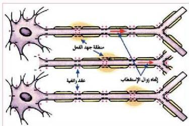

فحدوث زوال
استقطاب في نقطة ما
للمية عصبية يعتبر مثيراً
للنقطة المجاورة فيؤدي إلى
فتح قنوات الصوديوم في
تلك النقطة، فيحدث
زوال الاستقطاب، وتعود
النقطة السابقة إلى حالة
الاستقطاب.

الشكل (١٠) انتقال السيل العصبي في المية المبلينة بطريقة القفز.
وهكذا تسري موجة من زوال الاستقطاب، وإعادته خلال المية. ولكن في المية
العصبية المبلينة ينتقل زوال الاستقطاب من عقدة رافعة إلى أخرى، ويسمى النقل
القفزي. الشكل (١٠)، والانتقال بهذه الطريقة أسرع وأقل استهلاكية للطاقة من
النقل بطريقة التأثير الموضعي.

# ■ آلية انتقال السيل العصبي خلال التشابك العصبي :

- كيف ينتقل السيل العصبي من خلية عصبية إلى أخرى؟

ينتقل السيل العصبي المتكون في خلية عصبية إلى أخرى حتى يصل إلى عضو
استجابة بواسطة نواقل كيميائية عبر شق يسمى الشق التشابكي Synaptic Cleft.

ولنتعرف على كيفية هذا الانتقال، ادرس الشكل (١١) الذي يبين تكون
التشابك العصبي. من الغشاء قبل التشابكي والغشاء بعد التشابكي وبينهما فراغ
يدعى الشق التشابكي. يحتوي الغشاء قبل التشابكي على العديد من الحويصلات
التشابكية تحوي مواد كيميائية تدعى النواقل العصبية، وكذلك يحتوي على قنوات
لأيونات الكالسيوم التي توجد بتركيز عال خارج الغشاء قبل التشابكي مقارنة
بداخله. أما الغشاء بعد التشابكي فإنه يحتوي على مستقبلات للنواقل العصبية
ترتبط معها قنوات بروتينية للأيونات المختلفة.

- ما التغيرات التي تحدث عند دخول السيل العصبي إلى الغشاء قبل التشابكي؟
إن هذه التغيرات يمكن إجمائها بالآتي:

١- فتح قنوات الكالسيوم لتنتشر أيونات الكالسيوم إلى داخل الغشاء قبل
التشابكي.

١٨

الأحياء: النصف الثالث الثانوي

http://E-learning-moe.edu.ye