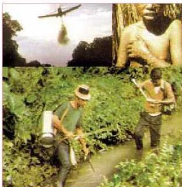
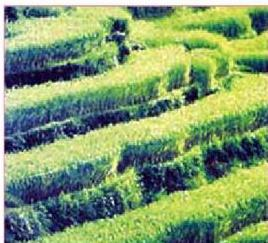

## سادساً : تلوث التربة:

تعرضت التربة إلى التلوث نتيجة لأنشطة الإنسان المختلفة، والنمو السكاني الزائد الذي تبعه زيادة نسبة الأرض المزروعة لتوفير الغذاء، وزيادة استغلال الموارد الطبيعية، وقد أدى ذلك إلى تغيير مكونات التربة الأساسية واستنفاد بعض عناصرها أو زيادة ملوحتها؛ نتيجة الاستعمال غير الجيد لمياه الري، والاستخدام العشوائي للأسمدة الكيميائية والمبيدات.

الشكل (١١) آثار المبيدات الحشرية

كما أدى الاستنزاف غير الواعي للكساء الأخضر من نباتات وأشجار إلى كشف التربة مما جعلها معرضة للتعرية والانجراف بتأثير عوامل الرياح والعواصف والأمطار. وقد أدت الزيادة الكبيرة في السكان والأنشطة الإنسانية المختلفة من زراعة وصناعة واستهلاك .. وغيرها إلى إنتاج ملايين الأطنان من النفايات الصلبة سنوياً، والتي تطرح في البيئة من خلال مقابل القمامة أو الأراضي الزراعية، مما أدى إلى استغلال مساحة شاسعة من التربة لهذه النفايات، إضافة إلى تلوث التربة بسبب طرح كثير من النفايات المنزلية الضارة كالعلب الفارغة وصناديق الكرتون والزجاج والأثاث المستهلك

الشكل (١٢) الكساء الأخضر يحفظ التربة

وبقايا الصناعات الحديدية. وأهم من ذلك المواد المصنعة من البلاستيك مثل الأكواب والأطباق وقوارير المياه والاستخدام العشوائي لأكياس النايلون وجميعها لا تتحلل بسهولة، وكل ذلك أدى إلى إتلاف التربة وزيادة مساحة الأراضي الملوثة مقابل نقصان مساحة الأراضي الصالحة للسكن والزراعة. كما أدت المبيدات المستعملة في

١٨٠

الأحياء للصف الثالث الثانوي