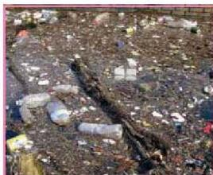

الشكل (١٣) تربة ملوثة

مكافحة الآفات الموجودة على النبات أو الموجودة على التربة إلى تهديد حياة الآلاف من الكائنات الحية النباتية والحيوانية في التربة مسببة دماراً لبعض الأنظمة البيئية نتيجة الإخلال بالتوازن البيولوجي للأحياء.

## **مشكلات استنزاف الموارد البيئية:**

تنقسم الموارد الطبيعية في البيئة إلى الأنواع الآتية:

### **١- موارد دائمة:**

وهي الموارد التي لا تنضب مهما استهلك منها الإنسان، ويتوقع أن تظل متوفرة حتى يرث الله الأرض ومن عليها، وهذه الموارد هي: الطاقة الشمسية والهواء والماء.

### **٢- موارد متجددة:**

وهي الموارد التي تمتلك القدرة على التجدد باستمرار، وهي الثروة الحيوانية والثروة النباتية والتربة، إلا أنها تتعرض إلى ضغط شديد بسبب أنشطة الإنسان المدمرة لها.

### **٣- موارد غير متجددة (ناضبة):**

وهي الموارد التي لا تتجدد، أو تتجدد ببطء شديد خلال آلاف السنين، وتوجد في البيئة بكميات محدودة مثل البترول والفحم الحجري والغاز الطبيعي وخامات المعادن.

إن قدرة الإنسان على استخدام الآلات والوسائل التكنولوجية الحديثة جعلته يستغل الموارد البيئية بأنواعها المختلفة، ويعمل على استنزافها بشكل متسارع، وقد أدى ذلك إلى الإخلال بتوازن النظم البيئية وتدهورها بشكل ملحوظ. ومن أهم الموارد التي يتم استغلالها واستنزافها بشكل شديد، سواء في بلادنا أم في كثير من البلدان الأخرى ما يأتي:

## **١- استنزاف المياه:**

تحصل بلادنا على احتياجاتها من الماء عن طريق مصدرين أساسيين هما مياه الأمطار والمياه الجوفية.

الأحياء للصف الثالث الثانوي

١٨١