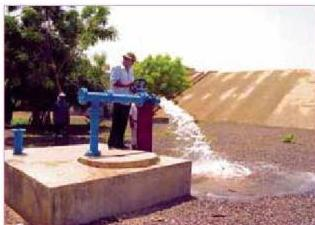

الشكل (١٤) مضخة ارتوازية تسحب الماء من جوف الأرض

وتعاني بلادنا حاليًا من الاستنزاف الشديد للمياه؛ حيث نضبت كثير من مصادرها الجوفية مثل حوض مدينة تعز.

ويتوقع أن تنضب أحواض جوفية أخرى مثل: حوض صنعاء، وحوض صعدة، إذا استمرت سلوكياتنا السلبية تجاهها.

- كيف تكونت أحواض المياه الجوفية؟

- لماذا يتوقع أن تنضب المياه الجوفية في بلادنا؟

لقد توصلت الدراسات إلى أن أهم عامل لانخفاض منسوب أحواض المياه الجوفية في اليمن هو الاستنزاف الشديد لمحتواها المائي؛ حيث إن ما يستهلك منها سنويًا لا يعوض من مياه الأمطار. وبدأ تناقص منسوب المياه في الأحواض الجوفية خلال النصف الثاني من القرن العشرين وحتى الآن نتيجة التوسع في حفر الآبار الارتوازية لري حقول القات، حيث بلغ عدد الآبار في حوض صنعاء فقط أكثر من (١٣) ألف بئر حتى الآن.

- لماذا لم يحصل تناقص في أحواض المياه الجوفية قبل هذه الفترة؟

إن الاستنزاف الشديد لأحواض المياه الجوفية في هذه الأيام لا يتم تعويضه مما يؤدي إلى حصول عجز سنوي ينتج عنه تناقص مستمر في الأحواض الجوفية حتى ينتهي محتواها من الماء. والجدول الآتي يوضح العجز السنوي الناتج:

|  حالة الماء | كمية الماء  |
| --- | --- |
|  - المياه الجوفية المستهلكة سنويًا. | ٢٨٠٠ - ٣٤٠٠ مليون متر مكعب.  |
|  - المياه المتجددة في الأحواض سنويًا. | ٢١٠٠ - ٢٥٠٠ مليون متر مكعب.  |
|  - العجز السنوي في الأحواض. | ٧٠٠ - ٩٠٠ مليون متر مكعب.  |

وتزداد خطورة هذا الاستنزاف على بلادنا من حقيقة أن اليمن تعد من أفقر الدول في الجانب المائي، إذ لا يتعدى تصيب الفرد السنوي من الماء (١٣٧) مترًا مكعبًا فقط، بينما حدد خط الفقر المائي بمقدار ١٠٠٠ م³ سنويًا على مستوى دول العالم، وحددت حاجة الفرد السنوية من الماء كل عام بمقدار ١٤٠٠ م³.

١٨٢

الأحياء النصف الثالث الثانوي