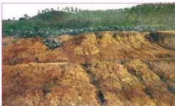
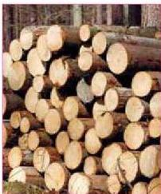

الشكل (١٥) انحراف التربة بفعل السيول

أ - إهمال الاعتناء بالمدرجات الزراعية والوديان والمحافظة على التربة فيها من الانحراف.
ب - الزحف الحضري على الأراضي الزراعية واستغلالها في بناء المساكن الجديدة أو المنشآت أو شق الطرق، وغير ذلك.

ج - القطع غير المرشد للاشجار والغطاء النباتي مما يؤدي إلى عدم تماسك التربة وبالتالي انحرافها وخاصة التربة الزراعية في المدرجات الجبلية والوديان.
وقد أدى التآكل المستمر للتربة الزراعية وإهمالها إلى ظهور مشكلة التصحر، وزحف الكثبان الرملية على الأراضي الزراعية، ويتوقع أن تكون ٩٧٪ من أراض الجمهورية اليمنية مهددة بالتصحر إذا استمرت المشكلة بدون وضع الحلول والمعالجات لها.
- ما أهم مظاهر التصحر في اليمن؟

# النشاط (٤)

• ناقش مع مجموعة من زملائك أهم المعالجات التي يجب اتباعها للمحافظة على التربة الزراعية من التدهور.

# ٢ - تدهور الغابات والثروة النباتية:

الشكل (١٦) اقتطاع الاشجار

تعتبر هذه المشكلة من المشكلات البيئية الرئيسية على مستوى العالم بشكل عام، وفي بلادنا بشكل خاص. فقد وجد أنه يتم اقتطاع حوالي ٢٠ مليون هكتار من الغابات كل عام على مستوى العالم، وفي بلادنا تم القضاء على الكثير من الغابات والاحراج، وخاصة في العقود القليلة الماضية. وأهم الأسباب التي تدفع الناس إلى اقتطاع الاشجار والقضاء على الغابات والمناطق الحرجية ما يأتي:

١٨٤

الأحياء للصف الثالث الثانوي