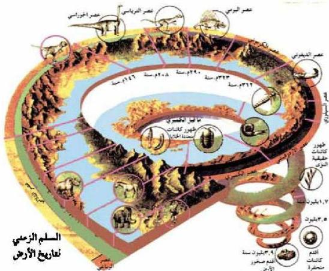

# تاريخ الأرض

# الوحدة الثامنة

# أهداف الوحدة

يتوقع منك بعد دراستك لهذه الوحدة أن تكون قادراً على أن:

١- توضح المقصود بكل من: - الطبقة. - سطح عدم التوافق الأحفوري.
- الأحفورة المرشدة. - مبدأ تعاقب الطبقات. - مبدأ تعاقب الحياة.
- المضاهاة. - السجل الجيولوجي. - سطح عدم التوافق.
٢- تبين أهمية دراسة الأحافير، وطرائق حفظها.
٣- توضح دور العلماء في بناء سلم الزمن الجيولوجي.
٤- تفسر بعض الأحداث الجيولوجية بناء على دراسة سلم الزمن الجيولوجي.
٥- تشرح أهم الأحداث الجيولوجية التي مرت بها الجمهورية اليمنية عبر الزمن.

الأحياء للصف الثالث الثانوي

١٨٧