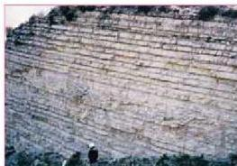

## تاريخ الأرض

هو مجموعة الظروف والأحداث التي مرت على تكون الصخور والطبقات الأرضية.

- ما المبادئ التي اعتمدت في تاريخ الأرض؟

- كيف تمكن العلماء من تقسيم الزمن الجيولوجي للأرض؟

لا يمكن الإلمام بتاريخ الأرض إلا إذا قسم إلى وحدات كبيرة وصغيرة، وتعتبر طبقات الصخور الرسوبية أصغر وحدة في تاريخ الأرض، وما تحتويه الطبقات من رواسب وأحافير دليل على زمن نشأة وتكون هذه الطبقات.

كيف تتكون الطبقات؟ وماذا تختلف الطبقات عن بعضها البعض؟

### ● أولاً: الصخور الرسوبية (الطبقية):

الشكل (١) طبقات رسوبية متعاقبة

توجد الصخور الطبقية في الطبيعة على شكل طبقات أفقية (متوازية) أو قريبة من الوضع الأفقي، وتتراكم فوق بعضها لتكون تعاقبات طبقية كما يظهر في الشكل (١)، ويسمى هذا بالتطبيق، ووحدته هي: الطبقة وهي أصغر وحدة صخرية تتراوح في سماكتها بين جزء من

الستيمتر إلى عدة أمتار حسب استمرارية مجالس المواد المترسبة فيها، وظروف التعرية والنقل وفترة الترسيب. فالطبقات الرقيقة كما تلاحظ في الشكل تمثل فترات ترسيب قصيرة، بينما الطبقات الأسمك تمثل فترات ترسيب أطول.

### - الطبقة (Stratum):

يمكن تعريف الطبقة بأنها وحدة مسطحة من الصخور الرسوبية لها تركيب معدني ونسيج مميز وقد تكون كُتليَّة، أو تحري تراكيب داخلية محددة أو تكون كُتليَّة تميزها عما فوقها وعما تحتها، ولكل طبقة سطح علوي وسطح سفلي، يفصلانها عن بقية الطبقات انظر الشكل (١). ويتكون التعاقب أو التتابع الطبقي؛ لأن الطبقة الواحدة تترسب في ظروف فيزيائية وكيميائية وبيولوجية محددة، وإذا اختلفت هذه الظروف أو إحداها يؤدي ذلك إلى انتهاء تكوين الطبقة السابقة، وبدء

١٨٨

الأحياء: النصف الثالث الثانوي