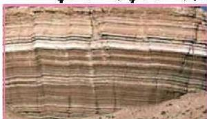

تكوين طبقة أخرى جديدة فوقها مختلفة عنها، وهكذا وباستمرار تراكم كثير من الطبقات وتصخرها في أثناء الزمن الجيولوجي يتكون التعاقب الطبقي.

فإذا تفحصت طبقتين متعاقبتين في الشكل (١) أو في الطبيعة، فإنك حتماً ستكتشف السبب الذي جعلهما طبقتين وليس طبقة واحدة، الاختلاف وقد يكون الآتي:

١- التركيب المعدني للطبقات، كالصخر الجيري والصخر الرملي أو الصخر الطيني.

٢- حجم الحبيبات المكونة لكل طبقة.

٣- شكل الحبيبات المكونة لكل طبقة.

٤- ترتيب الحبيبات المكونة لكل طبقة.

٥- نوع المادة اللاحمة للفتات الصخري لكل طبقة.

٦- وجود مادة أخرى غير متجانسة بين الطبقتين.

فمثلاً إذا تفحصت صفائح صخور الطفل (Shale) المتجانسة (شكل ٢) ترى أن التطبيق بين هذه الصفائح سببه وجود رقائق من الميكا مرصوفة فيما بينها.

## النقاط (١)

• قم بزيارة وزملاؤك إلى منطقة قريبة من المدرسة بها تتابع طبقي للصخور الرسوبية للتعرف على الطبقات وتحديد مميزات (خصائص) كل طبقة، ثم قدم تقريراً بملاحظاتك مدعماً بالرسم المقطع في الطبقات.

### - التوافق وعدم التوافق في الطبقات Conformity & Unconformity:

التوافق هو أن تكون الطبقات المترسبة أفقية موازية لبعضها البعض ومستمرة؛ بحيث تكون أسطح الطبقات المتعاقبة متوازية ومتتالية، مثل هذه الطبقات تسمى الطبقات المتوافقة كما يظهر في الشكل (١)، ويدل التوافق على استمرار الترسيب. إلا أننا لا نجد هذا في الطبيعة دائماً وإنما نجد الآتي:

- طبقات أفقية يلاحظ فيها عدم اكتمال مجموعة من الطبقات أو حتى غيابها.
- طبقات مائلة تعلوها طبقات أفقية.

وهذا يعني وجود عدم التوافق، مما يدل على وجود توقف في الترسيب لحقيقة زمنية. ما أنواع عدم التوافق؟ وما المقصود بسطح عدم التوافق؟

١٨٩

الأحياء الصف الثالث الثانوي