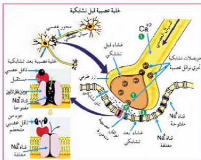

٢- التحكم
الحويصلات
التشابكية
بالغشاء قبل
التشابكي
بمساعدة أيونات
الكالسيوم،
وانفجارها،
وتحرر محتوياتها
من النواقل
العصبية في
الشق التشابكي.

الشكل (١١) انتقال السيل العصبي خلال التشابك العصبي.

٣- ارتباط جزئيات النواقل العصبية المتحررة مع المستقبلات على الغشاء بعد التشابكي يشكل مؤثراً كيميائياً يؤدي إلى فتح قنوات أيونات الصوديوم الموجودة في الغشاء بعد التشابكي، فتنتقل أيونات الصوديوم Na+ إلى داخل الخلية بعد التشابكية مما يسبب زوال الاستقطاب فيمر سيال عصبي خلال الغشاء الخلوي للخلية العصبية. إن عمل هذا الناقل يعتبر ناقلاً عصبياً منشطاً، أما إذا كان الناقل العصبي مثبطاً فإن ارتباطه مع المستقبلات يمنع انتقال السيل العصبي إلى الغشاء بعد التشابكي فيتوقف انتقاله وإحداث جهد فعل في الخلية بعد التشابكية.

٤- لا يستمر ارتباط جزئيات النواقل العصبية بمستقبلاتها لفترة طويلة؛ حيث تعمل آليات مختلفة في منطقة التشابك على إبطال تأثيرها بعد فترة وجيزة، فالناقل العصبي (أستيل كولين) يحطمه انزيم (أستيل كولين استريز) الموجود في الشق التشابكي، ويحوله إلى حمض الخليك، والكولين الذي يعاد امتصاصه، واستخدامه لبناء (أستيل كولين) جديد.

• تتدخل العقاقير في مسار السيلالات العصبية، ابحث في طرق تأثير العقاقير على الجهاز العصبي.

قضية البحث

الأحياء للصف الثالث الثانوي

١٩

http://E-learning-moe.edu.ye