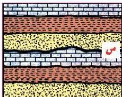
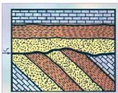
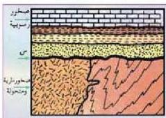

## أنواع عدم التوافق عديدة أهمها :

### ١- عدم التوافق الحتمي (Erosional Unconformity) :

الشكل (٣) عدم التوافق الحتمي

انظر الشكل (٣) تلاحظ مجموعتين من الطبقات السفلى الأقدم والعليا الأحدث، وبينهما سطح متعرج (س) يدل على أن طبقة أو عدة طبقات كانت بين المجموعتين لكنها الآن غير موجودة لتعرضها لعوامل التعرية، ويسمى السطح الفاصل المتعرج بسطح عدم التوافق.

### ٢- عدم التوافق الزاوي (Angular Unconformity) :

الشكل (٤) عدم التوافق الزاوي

في هذا النوع تكون مجموعة الطبقات الأقدم مائلة، أما مجموعة الطبقات الأحدث فهي أفقية كما يظهر في الشكل (٤) وما يميز هذا النوع عن السابق هو أن الصخور قد تعرضت إلى حركات أرضية، بعد انحسار البحر، أدت إلى ميلانها قبل حدوث الترسيب مرة أخرى للمجموعة الأحدث. ويستدل هنا على حدوث عدم التوافق من وجود طبقة صخور الكوخوليميرات (حصى وزلط) بقاعدة المجموعة العليا الأحدث.

### ٣- اللاتوافق (Nonconformity) :

الشكل (٥) عدم التوافق المتباين

يحدث اللاتوافق عندما تترسب صخور رسوبية فوق صخور نارية أو متحولة، ويعد السطح بينهما سطحاً لا متوافقاً، لأنه يمثل فترة انقطاع في الترسيب في وقت تكون الصخور النارية والمتحولة كما في الشكل (٥). وبناء على ما سبق يمكن تعريف سطح عدم التوافق بأنه: سطح يفصل بين مجموعتين من الصخور إحداهما قديمة والأخرى أحدث منها،

١٩٠

الأحياء للصف الثالث الثانوي