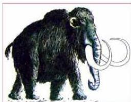
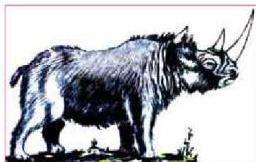
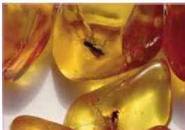

٤- أن لا تتعرض الطبقات التي تحتفظ بالأحافير لحركات أرضية عنيفة تؤدي إلى تحولها، وبالتالي إلى طمس معالمها أو محوها.

# - طرائق التحفر:

توجد طرائق عدة لحفظ بقايا الكائنات الحية وآثارها أهمها:

# ١- الحفظ الكامل:

وهي طريقة نادرة في التحفر حيث يحفظ الكائن بكل أجزائه أو الأجزاء الصلبة دون تغير في التركيب الكيميائي مثل حفريّة حيوان الماموث الذي وجد بكامله محتفظاً بنحمه وشعره، وغذائه داخل أمعائه في ثلوج سيبيريا انظر (الشكل ٦)، وحفريّة وحيد القرن الصوفي انظر (الشكل ٧) الذي وجد محفوظاً في الطبقات الإسفلتية في جبال الكاريات في أوروبا الشرقية.

- حفظ بعض الحشرات وحببات النقاط النباتية في الصمغ النباتي حيث التصقت به وانطمر الصمغ في الأرض وتحول بمرور الزمن إلى كهرمان كما في (الشكل ٨).

- حفظ الأجزاء الصلبة الأصلية يمضي وقت بين موت الكائن الحي وحفظه، وهذا يسمح بتحلل الأجزاء الرخوة وحفظ الأجزاء الصلبة دون أن يتغير تركيبها الكيميائي، فقد تكون الأحفورة عظاماً أو أسناناً أو أصدافاً وقواقع أو جذوعاً وأغصاناً وحبوب لقاح. انظر (الشكل ٩) ترى بقايا أجزاء صلبة لأصداف محفوظة

الشكل (٦) حفريّة الماموث الصوفي

الشكل (٧) حفريّة وحيد القرن الصوفي

الشكل (٨) حشرات محفوظة في الكهرمان

١٩٢

الأحياء للصف الثالث الثانوي