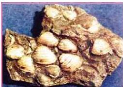
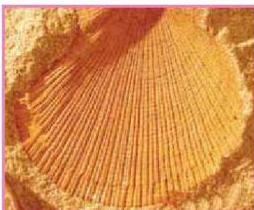
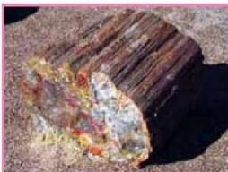

الشكل (٩) أحافير أصداف ثنائية المصاريع

الشكل (١٠) أحفورة مستبدلة من فوات المصراعين

الشكل (١١) أحفورة ساق شجرة متصخرة

كما هو الحال في الخشب، حيث تحل مادة السيلكا محل السليلوز، وتدعى هذه العملية تصخر الخشب (Petrification) كما في الشكل (١١).

ب - التشرب بالمعدن أو التمعدن (Permineralization) :

تحدث هذه العملية نتيجة ترسب بعض المعادن من المحاليل المتخللة للصخور

في حجر جيري مارلي كما هي محتفظة بتركيبها الأصلي دون تغير.

٢- تصخر الأجزاء الصلبة الأصلية :

وفيها تتحول المادة الأصلية لهياكل الحيوان أو النبات إلى مادة حجرية أو معدنية مع بقاء الشكل الخارجي والتفاصيل الأخرى دون تغيير.

وتعد هذه الطريقة من أهم طرائق حفظ الأحافير وتتم بإحدى الطرائق الآتية :

أ - الاستبدال أو الإحلال (Replacement)

يتم ذلك بأن تحل بعض المواد المعدنية الذائبة في المياه - التي تتخلل الصخور المحتوية على بقايا الكائنات كالسيليكا وأكاسيد الحديد وكربونات الكالسيوم وغيرها - إحلالاً كاملاً أو جزئياً محل المادة الصلبة الأصلية المكونة لهيكل الكائن الحي بحيث تحتفظ بشكلها وبجميع التفاصيل الدقيقة دون حدوث تغيير في شكل هيكل الكائن وحجمه. انظر الشكل (١٠) لأحفورة ذات مصراعين تغير التركيب الكيميائي للصدفة من الكالسييت إلى معدن الكوارتز مع بقاء شكل وحجم الصدفة كما هو. وإذا حل معدن ما محل المادة العضوية،

١٩٣

الأحياء للصف الثالث الثانوي